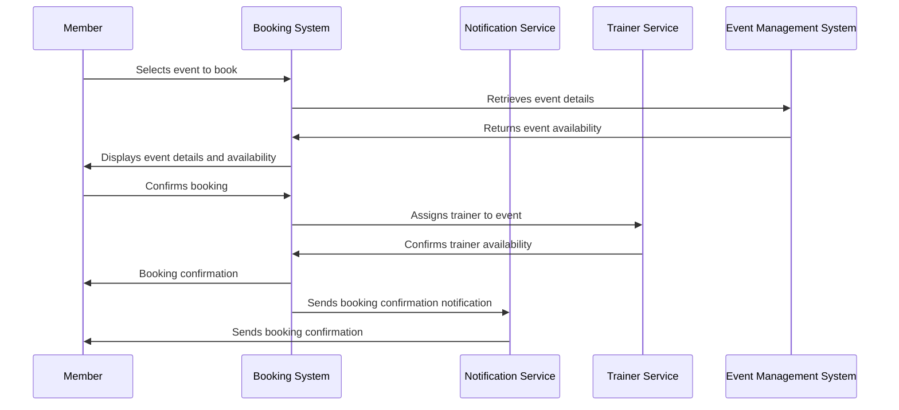
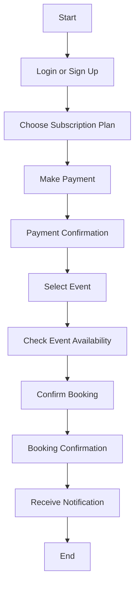
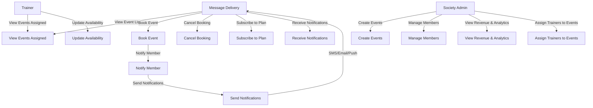

# Roster Management Application Design

## 1. Entities and Schema Design

### **Society**

- `id` (UUID, Primary Key)
- `name` (VARCHAR, Unique, Not Null)
- `location` (VARCHAR, Not Null)
- `max_members_per_event` (INT, Not Null, Default: 20)
- `created_at` (TIMESTAMP, Default: NOW)
- `updated_at` (TIMESTAMP, Default: NOW)

### **Member**

- `id` (UUID, Primary Key)
- `name` (VARCHAR, Not Null)
- `email` (VARCHAR, Unique, Not Null)
- `phone_number` (VARCHAR, Unique, Not Null)
- `society_id` (UUID, Foreign Key -> Society, Not Null)
- `subscription_id` (UUID, Foreign Key -> Subscription, Not Null)
- `status` (ENUM: ['pending', 'approved', 'rejected'], Default: 'pending')
- `created_at` (TIMESTAMP, Default: NOW)
- `updated_at` (TIMESTAMP, Default: NOW)

### **Trainer**

- `id` (UUID, Primary Key)
- `name` (VARCHAR, Not Null)
- `email` (VARCHAR, Unique, Not Null)
- `phone_number` (VARCHAR, Unique, Not Null)
- `specialization` (VARCHAR, Not Null)
- `created_at` (TIMESTAMP, Default: NOW)
- `updated_at` (TIMESTAMP, Default: NOW)

### **Event**

- `id` (UUID, Primary Key)
- `name` (VARCHAR, Not Null)
- `society_id` (UUID, Foreign Key -> Society, Not Null)
- `trainer_id` (UUID, Foreign Key -> Trainer, Not Null)
- `event_date` (DATE, Not Null)
- `start_time` (TIME, Not Null)
- `end_time` (TIME, Not Null)
- `max_members` (INT, Not Null, Default: 20)
- `created_at` (TIMESTAMP, Default: NOW)
- `updated_at` (TIMESTAMP, Default: NOW)

### **Booking**

- `id` (UUID, Primary Key)
- `member_id` (UUID, Foreign Key -> Member, Not Null)
- `event_id` (UUID, Foreign Key -> Event, Not Null)
- `booking_date` (DATE, Default: NOW)
- `created_at` (TIMESTAMP, Default: NOW)
- `updated_at` (TIMESTAMP, Default: NOW)

### **Subscription**

- `id` (UUID, Primary Key)
- `name` (VARCHAR, Unique, Not Null)
- `price` (DECIMAL, Not Null)
- `duration_in_days` (INT, Not Null)
- `created_at` (TIMESTAMP, Default: NOW)
- `updated_at` (TIMESTAMP, Default: NOW)

### **Payment**

- `id` (UUID, Primary Key)
- `member_id` (UUID, Foreign Key -> Member, Not Null)
- `subscription_id` (UUID, Foreign Key -> Subscription, Not Null)
- `amount` (DECIMAL, Not Null)
- `payment_status` (ENUM: ['pending', 'completed', 'failed'], Default: 'pending')
- `transaction_id` (VARCHAR, Unique, Not Null)
- `created_at` (TIMESTAMP, Default: NOW)
- `updated_at` (TIMESTAMP, Default: NOW)

### **Notification**

- `id` (UUID, Primary Key)
- `member_id` (UUID, Foreign Key -> Member, Not Null)
- `event_id` (UUID, Foreign Key -> Event, Not Null)
- `notification_type` (ENUM: ['reminder', 'new_event'], Not Null)
- `scheduled_time` (TIMESTAMP, Not Null)
- `status` (ENUM: ['pending', 'sent'], Default: 'pending')
- `created_at` (TIMESTAMP, Default: NOW)
- `updated_at` (TIMESTAMP, Default: NOW)

## 2. Modules

1. **Authentication Module** - Handles user login and signup.
2. **Society Management Module** - Manages society creation and configuration.
3. **Member Management Module** - Handles member onboarding, approvals, and profile updates.
4. **Trainer Management Module** - Manages trainers and their availability.
5. **Event Management Module** - Controls event creation, scheduling, and bookings.
6. **Subscription & Payment Module** - Manages subscription plans and payment processing.
7. **Booking Module** - Handles event bookings and cancellations.
8. **Notification Module** - Schedules and sends notifications and reminders.

## 3. Feature Breakdown by Modules

### **Authentication Module**

- User signup/login.
- Role-based access control.

### **Society Management Module**

- Create and manage societies.
- Configure max members per event.

### **Member Management Module**

- Onboard new members.
- Approve/reject member applications (Maker-Checker flow).
- Manage member profiles.

### **Trainer Management Module**

- Add/update trainer details.
- Set trainer availability.
- Assign trainers to events.

### **Event Management Module**

- Create/update events.
- Assign trainers.
- Enforce booking constraints.

### **Subscription & Payment Module**

- Create/manage subscription plans.
- Process payments and track transactions.

### **Booking Module**

- Allow members to book events.
- Restrict bookings as per rules.
- Cancel bookings.

### **Notification Module**

- Schedule event reminders.
- Notify members about new events.

## 4. API Breakdown

### **Authentication**

- `POST /auth/signup` → Register as a Member or Trainer.
- `POST /auth/login` → Authenticate user.

### **Society Management**

- `POST /societies` → Create a new society.
- `GET /societies` → Retrieve the list of societies.

### **Member Operations**

- `GET /members/{id}` → Retrieve member details.
- `GET /members/{id}/events` → View available events.
- `POST /members/{id}/bookings` → Book an event.
- `DELETE /members/{id}/bookings/{booking_id}` → Cancel a booking.
- `POST /members/{id}/subscribe` → Subscribe to a plan.

### **Trainer Operations**

- `GET /trainers/{id}/events` → View trainer’s scheduled events.
- `GET /trainers/{id}/participants/{event_id}` → Get participants of an event.

### **Event Management**

- `POST /events` → Create a new event.
- `GET /events?society_id=xyz` → Fetch all events in a society.

### **Booking Management**

- `GET /bookings/{member_id}` → Retrieve a member’s bookings.
- `POST /bookings` → Make a booking.
- `DELETE /bookings/{id}` → Cancel a booking.

### **Subscription & Payments**

- `GET /subscriptions` → Fetch available subscription plans.
- `POST /subscriptions` → Create a new subscription plan.
- `POST /payments` → Process payment for a subscription.
- `GET /payments/{member_id}` → Retrieve a member’s payment history.

### **Notifications**

- `GET /notifications/{member_id}` → Fetch all notifications for a member.
- `POST /notifications/schedule` → Schedule event reminders.

## 5. Database Choice

- **PostgreSQL** ensures relational consistency and data integrity.
- Indexing on `email`, `phone_number`, and `event_date` for optimized query performance.
- Constraints enforce business rules and prevent inconsistencies.

This refined design enhances **event participation control**, **structured notifications**, and **efficient scheduling**.

Here’s an updated Roster Management Application Design based on the previous **ArcFit system requirements**:

---

### **Entities and Schema Design**

#### 1. **Society**

```sql
id (UUID, Primary Key)
name (VARCHAR, Unique, Not Null)
location (VARCHAR, Not Null)
max_members_per_event (INT, Not Null, Default: 20)
capacity (INT, Not Null) -- Added to track total society capacity
revenue_details (DECIMAL, Not Null) -- To track society revenue
created_at (TIMESTAMP, Default: NOW)
updated_at (TIMESTAMP, Default: NOW)
```

#### 2. **Member**

```sql
id (UUID, Primary Key)
name (VARCHAR, Not Null)
email (VARCHAR, Unique, Not Null)
phone_number (VARCHAR, Unique, Not Null)
society_id (UUID, Foreign Key -> Society, Not Null)
subscription_id (UUID, Foreign Key -> Subscription, Not Null)
status (ENUM: ['pending', 'approved', 'rejected'], Default: 'pending')
booking_count (INT, Default: 0) -- Track the number of bookings per week
created_at (TIMESTAMP, Default: NOW)
updated_at (TIMESTAMP, Default: NOW)
```

#### 3. **Trainer**

```sql
id (UUID, Primary Key)
name (VARCHAR, Not Null)
email (VARCHAR, Unique, Not Null)
phone_number (VARCHAR, Unique, Not Null)
specialization (VARCHAR, Not Null)
location (VARCHAR, Not Null) -- To handle trainer-society location matching
maximum_classes_per_day (INT, Not Null, Default: 3) -- Enforce 3 classes per day
created_at (TIMESTAMP, Default: NOW)
updated_at (TIMESTAMP, Default: NOW)
```

#### 4. **Event**

```sql
id (UUID, Primary Key)
name (VARCHAR, Not Null)
society_id (UUID, Foreign Key -> Society, Not Null)
trainer_id (UUID, Foreign Key -> Trainer, Not Null)
event_date (DATE, Not Null)
start_time (TIME, Not Null)
end_time (TIME, Not Null)
max_members (INT, Not Null, Default: 20)
booking_limit (INT, Not Null, Default: 5) -- Booking limit per member
created_at (TIMESTAMP, Default: NOW)
updated_at (TIMESTAMP, Default: NOW)
```

#### 5. **Booking**

```sql
id (UUID, Primary Key)
member_id (UUID, Foreign Key -> Member, Not Null)
event_id (UUID, Foreign Key -> Event, Not Null)
booking_date (DATE, Default: NOW)
status (ENUM: ['confirmed', 'cancelled'], Default: 'confirmed') -- Track booking status
created_at (TIMESTAMP, Default: NOW)
updated_at (TIMESTAMP, Default: NOW)
```

#### 6. **Subscription**

```sql
id (UUID, Primary Key)
name (VARCHAR, Unique, Not Null)
price (DECIMAL, Not Null)
duration_in_days (INT, Not Null)
created_at (TIMESTAMP, Default: NOW)
updated_at (TIMESTAMP, Default: NOW)
```

#### 7. **Payment**

```sql
id (UUID, Primary Key)
member_id (UUID, Foreign Key -> Member, Not Null)
subscription_id (UUID, Foreign Key -> Subscription, Not Null)
amount (DECIMAL, Not Null)
payment_status (ENUM: ['pending', 'completed', 'failed'], Default: 'pending')
transaction_id (VARCHAR, Unique, Not Null)
created_at (TIMESTAMP, Default: NOW)
updated_at (TIMESTAMP, Default: NOW)
```

#### 8. **Notification**

```sql
id (UUID, Primary Key)
member_id (UUID, Foreign Key -> Member, Not Null)
event_id (UUID, Foreign Key -> Event, Not Null)
notification_type (ENUM: ['reminder', 'new_event'], Not Null)
scheduled_time (TIMESTAMP, Not Null)
status (ENUM: ['pending', 'sent'], Default: 'pending')
created_at (TIMESTAMP, Default: NOW)
updated_at (TIMESTAMP, Default: NOW)
```

---

### **Modules Breakdown**

#### 1. **Authentication Module**

- **Signup/login** with role-based access control.
- JWT-based authentication for users (Members, Trainers, Society Admins).
- OTP-based phone verification.

#### 2. **Society Management Module**

- Create and manage societies.
- Configure society-specific parameters like max members per event and revenue tracking.

#### 3. **Member Management Module**

- **Onboard members**, approve/reject applications with a Maker-Checker flow.
- Manage member profiles.
- **Track booking limits** per week (max 5 bookings per member).
- View **upcoming events** available for booking.

#### 4. **Trainer Management Module**

- Add and manage trainers.
- Track and manage **trainer availability** and **location** for society matching.
- Assign trainers to events based on **society location** and **trainer availability**.

#### 5. **Event Management Module**

- **Create/update events** and assign trainers.
- Enforce **booking constraints** (max 20 members per event, booking limit of 5 classes per week per member).
- **Schedule and generate weekly events** on Sundays, ensuring balanced class distribution.

#### 6. **Subscription & Payment Module**

- Create/manage subscription plans.
- Process **payments** for memberships.
- Track **payment status** (pending/completed/failed).

#### 7. **Booking Module**

- Allow members to **book/cancel events** based on available slots.
- Restrict bookings to a max of **5 classes per week**.
- Ensure **real-time availability tracking** and waitlist management.

#### 8. **Notification Module**

- **Schedule reminders** for upcoming events and bookings.
- Notify members about **new events** and booking status.
- Send **administrative alerts** for any system updates or issues.

---

### **API Breakdown**

#### 1. **Authentication**

- `POST /auth/signup`: Register as a **Member** or **Trainer**.
- `POST /auth/login`: Authenticate user.
- **JWT authentication** for protected routes.

#### 2. **Society Operations**

- `POST /societies`: Create a **new society**.
- `GET /societies`: Retrieve list of societies.

#### 3. **Member Operations**

- `GET /members/{id}`: Retrieve **member details**.
- `POST /members/{id}/bookings`: **Book an event**.
- `DELETE /members/{id}/bookings/{booking_id}`: **Cancel a booking**.
- `POST /members/{id}/subscribe`: **Subscribe** to a plan.

#### 4. **Trainer Operations**

- `GET /trainers/{id}/events`: View **trainer’s scheduled events**.
- `GET /trainers/{id}/participants/{event_id}`: Get **participants** of an event.

#### 5. **Event Management**

- `POST /events`: Create **new events**.
- `GET /events?society_id=xyz`: Fetch **events** for a society.

#### 6. **Booking Operations**

- `GET /bookings/{member_id}`: Retrieve **member’s bookings**.
- `POST /bookings`: **Make a booking** for an event.
- `DELETE /bookings/{id}`: **Cancel a booking**.

#### 7. **Subscription & Payments**

- `GET /subscriptions`: Fetch **subscription plans**.
- `POST /subscriptions`: **Create a new subscription plan**.
- `POST /payments`: **Process a payment** for a subscription.

#### 8. **Notification Operations**

- `GET /notifications/{member_id}`: Fetch **notifications** for a member.
- `POST /notifications/schedule`: **Schedule event reminders**.

---

### **Database Choice**

- **PostgreSQL** for relational consistency and data integrity.
- **Indexing** on email, phone_number, event_date for optimized query performance.
- Constraints enforced on critical fields (like max members, booking limits).

---

### **Key Technical Enhancements**

1. **Real-time Booking Management**:

   - Use **Redis** for managing real-time availability.
   - Implement a **booking window** and allow cancellations 1 hour before events.

2. **Automated Scheduling**:

   - Develop an **algorithm** to generate event schedules every week based on trainer availability, society location, and member demand.

3. **Scalable Architecture**:

   - Microservices approach to **scale independently**.
   - Caching layer to **handle concurrent requests**.

4. **Security**:
   - **Role-based access control** (for different user roles: Admin, Member, Trainer).
   - **Encryption** for sensitive data like member details and payment transactions.

---

This updated design incorporates all the features and requirements from the **ArcFit system**, including **scalability**, **trainer availability**, **booking management**, and **society-specific configurations**. Let me know if you'd like any further changes or additions!

---

## **Authentication Module Design**

The **Authentication Module** is responsible for user authentication and authorization, ensuring that users (members, trainers, and society admins) can securely access their respective roles in the system.

---

### **Key Features**

1. **User Signup/Login**: Handles the registration and login of members, trainers, and society admins.
2. **Role-Based Access Control**: Enforces permissions for different user roles (members, trainers, society admins, and super admins).
3. **JWT Authentication**: Utilizes JWT tokens for secure authentication and maintaining session state.
4. **Phone OTP Integration**: Adds an extra layer of security by integrating phone OTP authentication for critical operations.
5. **Password Management**: Implements secure password storage and handling (e.g., bcrypt hashing).

---

### **Entities**

#### 1. **User**

- `id`: UUID (Primary Key)
- `name`: VARCHAR (Not Null)
- `email`: VARCHAR (Unique, Not Null)
- `password`: VARCHAR (Not Null, hashed)
- `role`: ENUM ('member', 'trainer', 'society_admin', 'super_admin') (Not Null)
- `phone_number`: VARCHAR (Unique, Not Null)
- `status`: ENUM ('active', 'inactive') (Default: 'active')
- `created_at`: TIMESTAMP (Default: NOW)
- `updated_at`: TIMESTAMP (Default: NOW)

---

### **Schema for User Table**

```sql
CREATE TABLE users (
    id UUID PRIMARY KEY,
    name VARCHAR(255) NOT NULL,
    email VARCHAR(255) UNIQUE NOT NULL,
    password VARCHAR(255) NOT NULL,
    role ENUM('member', 'trainer', 'society_admin', 'super_admin') NOT NULL,
    phone_number VARCHAR(15) UNIQUE NOT NULL,
    status ENUM('active', 'inactive') DEFAULT 'active',
    created_at TIMESTAMP DEFAULT NOW(),
    updated_at TIMESTAMP DEFAULT NOW()
);
```

---

### **Authentication Process Flow**

#### **1. User Signup**

- **Inputs**: Name, Email, Phone Number, Password, Role (Member/Trainer/Society Admin).
- **Output**: User registration with hashed password stored in the system.
- **Process**:
  1. A user submits the registration form with their details.
  2. The system hashes the password and stores the data in the database.
  3. A confirmation email or SMS is sent to verify the user’s identity.

#### **2. User Login**

- **Inputs**: Email/Phone, Password.
- **Output**: JWT token is returned for session management.
- **Process**:
  1. The user enters their login credentials.
  2. The system validates the credentials and returns a JWT token if valid.

#### **3. Role-Based Access Control**

- **Inputs**: User role.
- **Output**: Ensures access control based on the user’s role.
- **Process**:
  1. The system verifies the user’s role (e.g., member, trainer, society admin).
  2. The role determines which resources the user can access (e.g., members can only book events, trainers can manage schedules).

---

### **APIs for Authentication**

#### **POST /auth/signup**

- **Description**: Registers a new user (member, trainer, society admin).
- **Request Body**:

```json
{
  "name": "John Doe",
  "email": "john.doe@example.com",
  "password": "hashed_password",
  "role": "member",
  "phone_number": "+1234567890"
}
```

- **Response**:

```json
{
  "id": "user-uuid",
  "name": "John Doe",
  "email": "john.doe@example.com",
  "role": "member",
  "status": "active",
  "created_at": "2025-01-30T12:00:00",
  "updated_at": "2025-01-30T12:00:00"
}
```

#### **POST /auth/login**

- **Description**: Authenticates a user and returns a JWT token.
- **Request Body**:

```json
{
  "email": "john.doe@example.com",
  "password": "password"
}
```

- **Response**:

```json
{
  "token": "jwt-token"
}
```

---

### **Security Measures**

1. **JWT Authentication**: Ensures users are securely authenticated through tokens.
2. **Role-based Access Control (RBAC)**: Each role is associated with different levels of access.
3. **Phone OTP**: Adds a layer of security for critical actions.
4. **Secure Password Storage**: All passwords are hashed using bcrypt or similar hashing algorithms.

---

## **Society Management Module Design**

The **Society Management Module** is responsible for creating and managing societies, their configurations, and ensuring that societies can be efficiently scaled to meet the needs of their members. This module manages the society profile, handles the maximum capacity per event, and tracks revenue and analytics related to society activities.

---

### **Key Features**

1. **Society Creation**: Allows the creation of a new society, including necessary details like name, location, and member capacity.
2. **Manage Society Configurations**: Society Admins can configure max members per event and adjust other society-specific settings.
3. **Revenue Tracking**: Tracks revenue generation per society, providing insights into class bookings, membership plans, and payment history.
4. **Analytics**: Provides basic society-level analytics (e.g., member engagement, booking trends).
5. **Society Admin Access**: Allows Society Admins to manage societies, configure their properties, and view insights.

---

### **Entities**

#### 1. **Society**

- `id`: UUID (Primary Key)
- `name`: VARCHAR (Unique, Not Null)
- `location`: VARCHAR (Not Null)
- `max_members_per_event`: INT (Not Null, Default: 20)
- `created_at`: TIMESTAMP (Default: NOW)
- `updated_at`: TIMESTAMP (Default: NOW)
- `revenue`: DECIMAL (Default: 0.0, Tracks total revenue generated)

#### 2. **Society Admin**

- `id`: UUID (Primary Key)
- `name`: VARCHAR (Not Null)
- `email`: VARCHAR (Unique, Not Null)
- `phone_number`: VARCHAR (Unique, Not Null)
- `society_id`: UUID (Foreign Key -> Society, Not Null)
- `role`: ENUM ('admin', 'super_admin') (Default: 'admin')
- `created_at`: TIMESTAMP (Default: NOW)
- `updated_at`: TIMESTAMP (Default: NOW)

---

### **Schema for Society Table**

```sql
CREATE TABLE societies (
    id UUID PRIMARY KEY,
    name VARCHAR(255) UNIQUE NOT NULL,
    location VARCHAR(255) NOT NULL,
    max_members_per_event INT NOT NULL DEFAULT 20,
    revenue DECIMAL(10, 2) DEFAULT 0.0,
    created_at TIMESTAMP DEFAULT NOW(),
    updated_at TIMESTAMP DEFAULT NOW()
);
```

### **Schema for Society Admin Table**

```sql
CREATE TABLE society_admins (
    id UUID PRIMARY KEY,
    name VARCHAR(255) NOT NULL,
    email VARCHAR(255) UNIQUE NOT NULL,
    phone_number VARCHAR(15) UNIQUE NOT NULL,
    society_id UUID NOT NULL REFERENCES societies(id),
    role ENUM('admin', 'super_admin') NOT NULL DEFAULT 'admin',
    created_at TIMESTAMP DEFAULT NOW(),
    updated_at TIMESTAMP DEFAULT NOW()
);
```

---

### **Society Management Process Flow**

#### **1. Create Society**

- **Inputs**: Society name, location, max_members_per_event.
- **Output**: A new society is created and stored in the database.
- **Process**:
  1. A Society Admin registers a new society.
  2. The system validates the input data and ensures that the society name is unique and other constraints are met.
  3. The system assigns a default `max_members_per_event` and a `revenue` of `0.0` upon creation.
  4. A default admin user (Society Admin) is associated with the society.

#### **2. Manage Society Configurations**

- **Inputs**: Changes to society configurations like `max_members_per_event`.
- **Output**: Updates the society configuration details.
- **Process**:
  1. Society Admin can update the maximum number of members allowed per event (`max_members_per_event`).
  2. These updates will automatically adjust future class bookings for the society, based on the new max members per event.

#### **3. Revenue Tracking**

- **Inputs**: Payments received, class bookings.
- **Output**: Updates the total revenue of the society based on bookings and payments.
- **Process**:
  1. When a payment is successfully processed through the **Payment Module**, the system will automatically update the `revenue` field of the corresponding society.
  2. A Society Admin can access the revenue data in real-time to track how much income the society is generating.

---

### **APIs for Society Management**

#### **POST /societies**

- **Description**: Create a new society.
- **Request Body**:

```json
{
  "name": "Sunshine Apartments",
  "location": "Sector 15, Delhi",
  "max_members_per_event": 25
}
```

- **Response**:

```json
{
  "id": "society-uuid",
  "name": "Sunshine Apartments",
  "location": "Sector 15, Delhi",
  "max_members_per_event": 25,
  "revenue": 0.0,
  "created_at": "2025-01-30T12:00:00",
  "updated_at": "2025-01-30T12:00:00"
}
```

#### **GET /societies/{id}/revenue**

- **Description**: Fetch the revenue for a specific society.
- **Response**:

```json
{
  "id": "society-uuid",
  "revenue": 5000.0
}
```

#### **GET /societies/{id}/analytics**

- **Description**: Fetch analytics for a specific society.
- **Response**:

````json
{
  "id": "society-uuid",
  "total_members": 150,
  "total_bookings": 500,
  "average_booking_rate": 75,
  "total_revenue": 5000.0
}
``

`


---

## **Member Management Module Design**

The **Member Management Module** is responsible for handling member onboarding, approval/rejection processes, and maintaining member profiles. It ensures that the membership process is smooth and provides necessary functionalities for society admins to manage member statuses effectively.

---

### **Key Features**

1. **Onboarding New Members**: Allows members to register with the system, providing necessary details like name, email, phone number, and society affiliation.
2. **Approve/Reject Member Applications**: Provides Society Admins with the ability to approve or reject members based on the society’s policies.
3. **Member Profile Management**: Enables members to update their profiles, including contact information and subscription status.
4. **Member Status Management**: Admins can track and change the status of members (pending, approved, rejected).
5. **Subscription Management**: Members can subscribe to various plans and make payments.
6. **Booking Management**: Allows members to book and cancel events based on the society rules and available slots.

---

### **Entities**

#### 1. **Member**

- `id`: UUID (Primary Key)
- `name`: VARCHAR (Not Null)
- `email`: VARCHAR (Unique, Not Null)
- `phone_number`: VARCHAR (Unique, Not Null)
- `society_id`: UUID (Foreign Key -> Society, Not Null)
- `subscription_id`: UUID (Foreign Key -> Subscription, Not Null)
- `status`: ENUM ('pending', 'approved', 'rejected') (Default: 'pending')
- `created_at`: TIMESTAMP (Default: NOW)
- `updated_at`: TIMESTAMP (Default: NOW)

---

### **Schema for Member Table**

```sql
CREATE TABLE members (
    id UUID PRIMARY KEY,
    name VARCHAR(255) NOT NULL,
    email VARCHAR(255) UNIQUE NOT NULL,
    phone_number VARCHAR(15) UNIQUE NOT NULL,
    society_id UUID NOT NULL REFERENCES societies(id),
    subscription_id UUID NOT NULL REFERENCES subscriptions(id),
    status ENUM('pending', 'approved', 'rejected') DEFAULT 'pending',
    created_at TIMESTAMP DEFAULT NOW(),
    updated_at TIMESTAMP DEFAULT NOW()
);
````

---

### **Process Flow**

#### **1. Member Onboarding**

- **Inputs**: Name, Email, Phone Number, Society ID.
- **Output**: A new member is created and placed in a pending state.
- **Process**:
  1. The member provides their details (name, email, phone number) and chooses a society.
  2. The system validates the details and creates a pending entry in the `members` table with the associated society ID.
  3. A Society Admin reviews the application and either approves or rejects the member.

#### **2. Approve/Reject Member Applications**

- **Inputs**: Member ID, Action (Approve/Reject).
- **Output**: Updates the member’s status (approved/rejected).
- **Process**:
  1. The Society Admin reviews the member's application.
  2. The system updates the `status` field for the respective member to either `approved` or `rejected`.
  3. An approval or rejection notification is sent to the member.

#### **3. Member Profile Management**

- **Inputs**: Updates to member profile details such as email, phone number, or subscription plan.
- **Output**: Member profile is updated in the system.
- **Process**:
  1. The member can log in and view/update their profile.
  2. The system validates and updates the member's profile information in the database.

#### **4. Subscription Management**

- **Inputs**: Subscription ID, Payment Confirmation.
- **Output**: Updates the member’s subscription status to active and enables booking capabilities.
- **Process**:
  1. The member selects a subscription plan from available options.
  2. Upon successful payment, the subscription ID is linked to the member’s profile.

#### **5. Booking Management**

- **Inputs**: Event ID, Member ID.
- **Output**: The member can book events or cancel bookings.
- **Process**:
  1. After the member’s approval and subscription, they are eligible to book events.
  2. The system checks for availability and confirms the booking.
  3. If the member wants to cancel, the system allows cancellations within allowed time frames.

---

### **APIs for Member Management**

#### **POST /members**

- **Description**: Create a new member.
- **Request Body**:

```json
{
  "name": "John Doe",
  "email": "john.doe@example.com",
  "phone_number": "+1234567890",
  "society_id": "society-uuid",
  "subscription_id": "subscription-uuid"
}
```

- **Response**:

```json
{
  "id": "member-uuid",
  "name": "John Doe",
  "email": "john.doe@example.com",
  "status": "pending",
  "created_at": "2025-01-30T12:00:00",
  "updated_at": "2025-01-30T12:00:00"
}
```

#### **GET /members/{id}**

- **Description**: Retrieve details of a member.
- **Response**:

```json
{
  "id": "member-uuid",
  "name": "John Doe",
  "email": "john.doe@example.com",
  "phone_number": "+1234567890",
  "status": "approved",
  "society_id": "society-uuid",
  "subscription_id": "subscription-uuid",
  "created_at": "2025-01-30T12:00:00",
  "updated_at": "2025-01-30T12:00:00"
}
```

#### **POST /members/{id}/status**

- **Description**: Approve or reject a member's application.
- **Request Body**:

```json
{
  "status": "approved"
}
```

- **Response**:

```json
{
  "id": "member-uuid",
  "status": "approved",
  "updated_at": "2025-01-30T12:00:00"
}
```

#### **POST /members/{id}/subscribe**

- **Description**: Subscribe a member to a subscription plan.
- **Request Body**:

```json
{
  "subscription_id": "subscription-uuid"
}
```

- **Response**:

```json
{
  "id": "member-uuid",
  "subscription_id": "subscription-uuid",
  "status": "approved",
  "updated_at": "2025-01-30T12:00:00"
}
```

#### **GET /members/{id}/bookings**

- **Description**: Retrieve a list of bookings made by the member.
- **Response**:

```json
{
  "bookings": [
    {
      "id": "booking-uuid",
      "event_id": "event-uuid",
      "event_name": "Dance Class",
      "booking_date": "2025-02-01",
      "status": "confirmed"
    }
  ]
}
```

#### **POST /members/{id}/bookings**

- **Description**: Book an event.
- **Request Body**:

```json
{
  "event_id": "event-uuid"
}
```

- **Response**:

```json
{
  "id": "booking-uuid",
  "event_id": "event-uuid",
  "booking_date": "2025-02-01",
  "status": "confirmed"
}
```

#### **DELETE /members/{id}/bookings/{booking_id}**

- **Description**: Cancel a booking.
- **Response**:

```json
{
  "id": "booking-uuid",
  "status": "cancelled"
}
```

---

### **Security Measures**

1. **Role-Based Access Control**: Ensures that only Society Admins can approve or reject members and update member statuses.
2. **Data Validation**: Ensures that member details (email, phone, etc.) are validated before being stored.
3. **Member Data Encryption**: Sensitive member data such as email, phone numbers, and subscription details are encrypted in transit.

---

### **Scalability Considerations**

1. **Horizontal Scaling**: The member management system should support horizontal scaling, especially for handling a growing number of members.
2. **Database Sharding**: For efficient storage and retrieval, especially for large societies with thousands of members, database sharding strategies should be employed.
3. **Caching for Frequently Accessed Data**: Member status, bookings, and subscription data can be cached to reduce load on the database for frequent requests.

---

## **Trainer Management Module Design**

The **Trainer Management Module** is responsible for managing the trainer profiles, their availability, and their assignments to various events within the society. It ensures that the right trainer is assigned to the appropriate events based on their specialization, availability, and proximity to the society location.

---

### **Key Features**

1. **Trainer Profile Management**: Allows society admins to add and update trainer profiles, including personal information, specialization, and contact details.
2. **Trainer Availability**: Trainers can set their availability for events, and the system ensures that they do not exceed their maximum daily workload.
3. **Trainer Assignment**: Assigns trainers to events based on specialization, availability, and location.
4. **Workload Management**: Ensures that trainers do not exceed the maximum number of events they can handle per day.
5. **Trainer-Society Matching**: Uses a location-based algorithm to match trainers with societies, optimizing travel time and workload distribution.
6. **Trainer Event Management**: Enables trainers to view their assigned events, track participants, and update their availability.

---

### **Entities**

#### 1. **Trainer**

- `id`: UUID (Primary Key)
- `name`: VARCHAR (Not Null)
- `email`: VARCHAR (Unique, Not Null)
- `phone_number`: VARCHAR (Unique, Not Null)
- `specialization`: VARCHAR (Not Null)
- `location`: VARCHAR (Not Null)
- `max_classes_per_day`: INT (Default: 3)
- `created_at`: TIMESTAMP (Default: NOW)
- `updated_at`: TIMESTAMP (Default: NOW)

---

### **Schema for Trainer Table**

```sql
CREATE TABLE trainers (
    id UUID PRIMARY KEY,
    name VARCHAR(255) NOT NULL,
    email VARCHAR(255) UNIQUE NOT NULL,
    phone_number VARCHAR(15) UNIQUE NOT NULL,
    specialization VARCHAR(255) NOT NULL,
    location VARCHAR(255) NOT NULL,
    max_classes_per_day INT DEFAULT 3,
    created_at TIMESTAMP DEFAULT NOW(),
    updated_at TIMESTAMP DEFAULT NOW()
);
```

---

### **Process Flow**

#### **1. Trainer Profile Management**

- **Inputs**: Trainer’s name, email, phone number, specialization, location.
- **Output**: A new trainer is added to the system or an existing profile is updated.
- **Process**:
  1. The Society Admin adds a new trainer to the system, providing personal and professional details.
  2. The trainer profile is stored in the `trainers` table.
  3. The system ensures no duplicate entries for email or phone number.

#### **2. Trainer Availability Management**

- **Inputs**: Trainer ID, Event Date, Available Time Slots.
- **Output**: Trainer availability is updated in the system.
- **Process**:
  1. The trainer logs into the system and sets their availability for upcoming events.
  2. The system ensures that the trainer does not exceed the maximum classes per day (default 3).
  3. The availability data is stored and associated with the respective trainer.

#### **3. Trainer Assignment**

- **Inputs**: Event ID, Trainer ID.
- **Output**: The system assigns the appropriate trainer to an event.
- **Process**:
  1. Based on the event’s type (Yoga/Dance), the system identifies trainers with the required specialization.
  2. The system checks the trainer’s availability for the event’s scheduled time and ensures they are not overbooked.
  3. The trainer is then assigned to the event, and the assignment is stored in the system.

#### **4. Workload Management**

- **Inputs**: Trainer ID, Event Date.
- **Output**: The system ensures that the trainer does not exceed their daily class limit.
- **Process**:
  1. Each trainer is allowed a maximum of 3 classes per day (configurable).
  2. When assigning a trainer to an event, the system checks the trainer's existing bookings for that day.
  3. If the trainer has already reached their limit, the system will prevent the assignment and suggest available trainers.

#### **5. Trainer-Society Matching**

- **Inputs**: Trainer ID, Society Location.
- **Output**: The system assigns the trainer to a society based on location proximity.
- **Process**:
  1. Trainers and societies are geographically mapped.
  2. The system evaluates the distance between the trainer’s location and the society.
  3. Based on proximity, the system assigns trainers to societies to optimize travel time.

#### **6. Trainer Event Management**

- **Inputs**: Trainer ID.
- **Output**: Trainer views their assigned events and participants.
- **Process**:
  1. Trainers can log in to the system to view their assigned events.
  2. They can track the event details, including participants and class schedules.
  3. If needed, the trainer can update their availability for future events.

---

### **APIs for Trainer Management**

#### **POST /trainers**

- **Description**: Add a new trainer to the system.
- **Request Body**:

```json
{
  "name": "Jane Doe",
  "email": "jane.doe@example.com",
  "phone_number": "+1234567890",
  "specialization": "Yoga",
  "location": "Society A",
  "max_classes_per_day": 3
}
```

- **Response**:

```json
{
  "id": "trainer-uuid",
  "name": "Jane Doe",
  "specialization": "Yoga",
  "location": "Society A",
  "max_classes_per_day": 3,
  "created_at": "2025-01-30T12:00:00",
  "updated_at": "2025-01-30T12:00:00"
}
```

#### **GET /trainers/{id}**

- **Description**: Retrieve a trainer’s profile details.
- **Response**:

```json
{
  "id": "trainer-uuid",
  "name": "Jane Doe",
  "email": "jane.doe@example.com",
  "phone_number": "+1234567890",
  "specialization": "Yoga",
  "location": "Society A",
  "max_classes_per_day": 3,
  "created_at": "2025-01-30T12:00:00",
  "updated_at": "2025-01-30T12:00:00"
}
```

#### **POST /trainers/{id}/availability**

- **Description**: Set availability for a trainer.
- **Request Body**:

```json
{
  "event_date": "2025-02-01",
  "available_slots": ["10:00 AM - 11:00 AM", "2:00 PM - 3:00 PM"]
}
```

- **Response**:

```json
{
  "id": "trainer-uuid",
  "event_date": "2025-02-01",
  "available_slots": ["10:00 AM - 11:00 AM", "2:00 PM - 3:00 PM"],
  "updated_at": "2025-01-30T12:00:00"
}
```

#### **POST /trainers/{id}/assign**

- **Description**: Assign a trainer to an event.
- **Request Body**:

```json
{
  "event_id": "event-uuid"
}
```

- **Response**:

```json
{
  "trainer_id": "trainer-uuid",
  "event_id": "event-uuid",
  "assigned_at": "2025-01-30T12:00:00"
}
```

#### **GET /trainers/{id}/events**

- **Description**: Retrieve all events assigned to a specific trainer.
- **Response**:

```json
{
  "events": [
    {
      "id": "event-uuid",
      "name": "Yoga Class",
      "date": "2025-02-01",
      "start_time": "10:00 AM",
      "end_time": "11:00 AM"
    }
  ]
}
```

---

### **Security Measures**

1. **Role-Based Access Control**: Ensures only Society Admins and trainers can view and update trainer profiles and availability.
2. **Data Encryption**: Sensitive data like contact details and availability are encrypted in transit.
3. **Data Validation**: Ensures that trainer profiles are correctly validated before storing in the system.

---

### **Scalability Considerations**

1. **Horizontal Scaling**: The trainer management module should support horizontal scaling to accommodate an increasing number of trainers and societies.
2. **Database Optimization**: Indexes should be added on trainer details like `specialization`, `location`, and `email` to optimize search queries.
3. **Load Balancing**: Distributed systems and load balancing techniques should be employed for scaling the backend to handle requests for trainer availability and assignments.

---

## **Event Management Module Design**

The **Event Management Module** is responsible for creating, managing, and scheduling events for societies. It handles the event lifecycle, including event creation, trainer assignment, member bookings, and enforcing booking constraints. This module ensures that events are scheduled efficiently, with the right trainers assigned, and that the maximum number of members per event is not exceeded.

---

### **Key Features**

1. **Event Creation**: Allows society admins to create new events by specifying event details such as name, date, time, and trainer.
2. **Trainer Assignment**: Ensures that a trainer is assigned to each event based on availability and specialization.
3. **Booking Constraints**: Enforces booking rules such as maximum members per event and booking time windows.
4. **Event Scheduling**: Automatically schedules events based on trainer availability and society requirements.
5. **Booking Management**: Allows members to book and cancel event slots while tracking real-time availability.
6. **Event Cancellation**: Allows for event cancellations or rescheduling in case of conflicts or other issues.
7. **Event Status Tracking**: Tracks the status of events, including scheduled, completed, and canceled events.
8. **Event Analytics**: Provides event-level insights such as member attendance, booking trends, and revenue.

---

### **Entities**

#### 1. **Event**

- `id`: UUID (Primary Key)
- `name`: VARCHAR (Not Null)
- `society_id`: UUID (Foreign Key -> Society, Not Null)
- `trainer_id`: UUID (Foreign Key -> Trainer, Not Null)
- `event_date`: DATE (Not Null)
- `start_time`: TIME (Not Null)
- `end_time`: TIME (Not Null)
- `max_members`: INT (Not Null, Default: 20)
- `created_at`: TIMESTAMP (Default: NOW)
- `updated_at`: TIMESTAMP (Default: NOW)

---

### **Schema for Event Table**

```sql
CREATE TABLE events (
    id UUID PRIMARY KEY,
    name VARCHAR(255) NOT NULL,
    society_id UUID REFERENCES societies(id) NOT NULL,
    trainer_id UUID REFERENCES trainers(id) NOT NULL,
    event_date DATE NOT NULL,
    start_time TIME NOT NULL,
    end_time TIME NOT NULL,
    max_members INT NOT NULL DEFAULT 20,
    created_at TIMESTAMP DEFAULT NOW(),
    updated_at TIMESTAMP DEFAULT NOW()
);
```

---

### **Process Flow**

#### **1. Event Creation**

- **Inputs**: Event Name, Society ID, Trainer ID, Event Date, Start Time, End Time, Maximum Members.
- **Output**: A new event is created and stored in the database.
- **Process**:
  1. The Society Admin creates a new event, filling in necessary details such as event name, date, time, and trainer.
  2. The system checks that the trainer is available for the event’s date and time.
  3. The event is added to the `events` table, and a record of the trainer’s assignment is stored.

#### **2. Trainer Assignment**

- **Inputs**: Event ID, Trainer ID.
- **Output**: The event is associated with a trainer, and the trainer’s schedule is updated.
- **Process**:
  1. After an event is created, the system verifies the trainer’s availability for the event’s time slot.
  2. The system checks the trainer’s workload to ensure they do not exceed the maximum number of classes per day.
  3. If the trainer is available, the system assigns them to the event, and the trainer’s schedule is updated.

#### **3. Booking Management**

- **Inputs**: Member ID, Event ID.
- **Output**: Member’s booking is added to the event, or an error message if the event is fully booked.
- **Process**:
  1. A member logs into the system and views available events.
  2. The system checks the current booking status for the event (i.e., whether there are available slots).
  3. If slots are available, the member can book the event, and the booking is added to the `bookings` table.
  4. If the event is full, the member is added to the waitlist (if applicable).

#### **4. Booking Constraints**

- **Inputs**: Event ID, Member ID.
- **Output**: Booking is either confirmed or rejected based on constraints.
- **Process**:
  1. The system enforces booking rules such as the maximum number of members per event and a maximum of 5 classes per member per week.
  2. If a member tries to book more than the allowed number of events, the system rejects the booking.
  3. If the event has reached the maximum number of bookings, the system notifies the member that the event is full.

#### **5. Event Cancellation**

- **Inputs**: Event ID, Reason for Cancellation.
- **Output**: Event status is updated to canceled.
- **Process**:
  1. The Society Admin can cancel an event due to unforeseen circumstances or scheduling conflicts.
  2. The system automatically updates the event’s status to canceled and sends notifications to all affected members.

#### **6. Event Status Tracking**

- **Inputs**: Event ID.
- **Output**: Current status of the event (scheduled, completed, canceled).
- **Process**:
  1. The system tracks the status of each event from creation to completion.
  2. Upon the event date passing, the system updates the event status to "completed."
  3. If an event is canceled, the system updates the status to "canceled."

#### **7. Event Analytics**

- **Inputs**: Event ID.
- **Output**: Event analytics data, such as member attendance and revenue.
- **Process**:
  1. The system tracks event attendance and booking trends.
  2. Admins can view analytics such as the number of bookings, number of attendees, and revenue generated by the event.

---

### **APIs for Event Management**

#### **POST /events**

- **Description**: Create a new event.
- **Request Body**:

```json
{
  "name": "Yoga Class",
  "society_id": "society-uuid",
  "trainer_id": "trainer-uuid",
  "event_date": "2025-02-01",
  "start_time": "10:00 AM",
  "end_time": "11:00 AM",
  "max_members": 20
}
```

- **Response**:

```json
{
  "id": "event-uuid",
  "name": "Yoga Class",
  "society_id": "society-uuid",
  "trainer_id": "trainer-uuid",
  "event_date": "2025-02-01",
  "start_time": "10:00 AM",
  "end_time": "11:00 AM",
  "max_members": 20,
  "created_at": "2025-01-30T12:00:00",
  "updated_at": "2025-01-30T12:00:00"
}
```

#### **GET /events?society_id=xyz**

- **Description**: Fetch all events in a society.
- **Response**:

```json
{
  "events": [
    {
      "id": "event-uuid",
      "name": "Yoga Class",
      "date": "2025-02-01",
      "start_time": "10:00 AM",
      "end_time": "11:00 AM",
      "max_members": 20
    }
  ]
}
```

#### **POST /events/{id}/cancel**

- **Description**: Cancel an event.
- **Request Body**:

```json
{
  "reason": "Trainer unavailable"
}
```

- **Response**:

```json
{
  "id": "event-uuid",
  "status": "canceled",
  "updated_at": "2025-01-30T12:00:00"
}
```

#### **POST /events/{id}/bookings**

- **Description**: Book a member for an event.
- **Request Body**:

```json
{
  "member_id": "member-uuid"
}
```

- **Response**:

```json
{
  "id": "booking-uuid",
  "member_id": "member-uuid",
  "event_id": "event-uuid",
  "booking_date": "2025-01-30",
  "created_at": "2025-01-30T12:00:00"
}
```

#### **GET /events/{id}/analytics**

- **Description**: Fetch event analytics.
- **Response**:

```json
{
  "attendance_count": 15,
  "revenue_generated": 300,
  "total_bookings": 20
}
```

---

### **Security Measures**

1. **Role-Based Access Control**: Only Society Admins and Trainers can manage event creation, scheduling, and cancellations.
2. **Data Validation**: Ensures event details (such as date, time, and trainer) are correctly validated before being stored in the system.
3. **Booking Constraints Enforcement**: Automatically rejects bookings that exceed defined limits (e.g., maximum attendees per event).

---

### **Scalability Considerations**

1. **Horizontal Scaling**: The event management module should scale horizontally to handle an increasing number of events and members.
2. **Database Optimization**: Indexes should be added on `event_date`, `society_id`, and `trainer_id` to optimize event retrieval and assignment.
3. **Load Balancing**: Use load balancing techniques to distribute requests for event bookings and scheduling efficiently.

---

## **Subscription & Payment Module Design**

The **Subscription & Payment Module** is responsible for managing the subscription plans, payment processing, and transaction tracking. This module ensures that members can easily subscribe to plans, make payments, and maintain their subscription status. It also tracks payments and provides necessary details to society admins.

---

### **Key Features**

1. **Subscription Plans**: Allows admins to create and manage different subscription plans, defining the price, duration, and benefits.
2. **Payment Processing**: Handles payment transactions, including the initiation, success, failure, and refund processing.
3. **Subscription Management**: Manages the subscription status of each member (active, expired, canceled).
4. **Transaction Tracking**: Tracks payment history and provides detailed reports.
5. **Payment Notifications**: Notifies members about successful, pending, or failed transactions.
6. **Invoice Generation**: Generates invoices for each successful transaction.
7. **Refunds**: Supports refund processing for canceled or failed payments.
8. **Subscription Renewal**: Manages the renewal process for subscriptions, either manually by admins or automatically.

---

### **Entities**

#### 1. **Subscription**

- `id`: UUID (Primary Key)
- `name`: VARCHAR (Unique, Not Null)
- `price`: DECIMAL (Not Null)
- `duration_in_days`: INT (Not Null)
- `created_at`: TIMESTAMP (Default: NOW)
- `updated_at`: TIMESTAMP (Default: NOW)

#### 2. **Payment**

- `id`: UUID (Primary Key)
- `member_id`: UUID (Foreign Key -> Member, Not Null)
- `subscription_id`: UUID (Foreign Key -> Subscription, Not Null)
- `amount`: DECIMAL (Not Null)
- `payment_status`: ENUM: ['pending', 'completed', 'failed'] (Default: 'pending')
- `transaction_id`: VARCHAR (Unique, Not Null)
- `payment_date`: TIMESTAMP (Default: NOW)
- `created_at`: TIMESTAMP (Default: NOW)
- `updated_at`: TIMESTAMP (Default: NOW)

---

### **Schema for Subscription and Payment Tables**

```sql
CREATE TABLE subscriptions (
    id UUID PRIMARY KEY,
    name VARCHAR(255) UNIQUE NOT NULL,
    price DECIMAL NOT NULL,
    duration_in_days INT NOT NULL,
    created_at TIMESTAMP DEFAULT NOW(),
    updated_at TIMESTAMP DEFAULT NOW()
);

CREATE TABLE payments (
    id UUID PRIMARY KEY,
    member_id UUID REFERENCES members(id) NOT NULL,
    subscription_id UUID REFERENCES subscriptions(id) NOT NULL,
    amount DECIMAL NOT NULL,
    payment_status ENUM('pending', 'completed', 'failed') DEFAULT 'pending',
    transaction_id VARCHAR(255) UNIQUE NOT NULL,
    payment_date TIMESTAMP DEFAULT NOW(),
    created_at TIMESTAMP DEFAULT NOW(),
    updated_at TIMESTAMP DEFAULT NOW()
);
```

---

### **Process Flow**

#### **1. Subscription Creation**

- **Inputs**: Subscription Name, Price, Duration.
- **Output**: A new subscription plan is created and stored in the database.
- **Process**:
  1. The Society Admin creates a subscription plan, specifying the plan name, price, and duration in days.
  2. The system stores the subscription plan in the `subscriptions` table, making it available for members to subscribe to.

#### **2. Member Subscription**

- **Inputs**: Member ID, Subscription ID.
- **Output**: Member subscribes to the chosen plan.
- **Process**:
  1. The member selects a subscription plan based on their preference (e.g., monthly, yearly).
  2. The system checks if the member has any active subscription, and if they do, it either renews or updates the existing subscription.
  3. The member proceeds with the payment.

#### **3. Payment Processing**

- **Inputs**: Member ID, Subscription ID, Amount.
- **Output**: Payment is either completed or failed.
- **Process**:
  1. The system initiates a payment request with the payment gateway.
  2. The system waits for the response from the payment gateway, which can either confirm the payment (completed) or mark it as failed.
  3. The system updates the `payments` table with the payment status and stores the transaction ID for future reference.

#### **4. Transaction Status**

- **Inputs**: Transaction ID.
- **Output**: Payment status (Pending, Completed, Failed).
- **Process**:
  1. The payment status is checked after a transaction.
  2. If the payment is successful, the subscription is marked as active.
  3. If the payment fails, the system retries the payment or notifies the member for further action.

#### **5. Payment Notifications**

- **Inputs**: Member ID, Payment Status.
- **Output**: A notification is sent to the member regarding the payment status.
- **Process**:
  1. After the payment is processed, the system sends a notification to the member about the payment outcome (successful, pending, or failed).
  2. In case of failure, the member is advised to retry the payment or contact support.

#### **6. Payment Invoice Generation**

- **Inputs**: Payment ID.
- **Output**: An invoice is generated for the payment made.
- **Process**:
  1. Once the payment is completed, the system generates an invoice with details like the subscription name, amount paid, date, and transaction ID.
  2. The invoice is either emailed to the member or made available in the member's dashboard.

#### **7. Refunds**

- **Inputs**: Payment ID, Reason for Refund.
- **Output**: Payment is refunded, and the subscription is either canceled or adjusted.
- **Process**:
  1. If the member requests a refund (e.g., for canceled subscription or failed payment), the system processes the refund.
  2. The subscription status is updated to "canceled," and the refund amount is returned to the member’s payment method.
  3. Refund details are stored in the `payments` table.

---

### **APIs for Subscription & Payment Management**

#### **POST /subscriptions**

- **Description**: Create a new subscription plan.
- **Request Body**:

```json
{
  "name": "Premium Plan",
  "price": 100.0,
  "duration_in_days": 30
}
```

- **Response**:

```json
{
  "id": "subscription-uuid",
  "name": "Premium Plan",
  "price": 100.0,
  "duration_in_days": 30,
  "created_at": "2025-01-30T12:00:00",
  "updated_at": "2025-01-30T12:00:00"
}
```

#### **POST /payments**

- **Description**: Process a payment for a subscription.
- **Request Body**:

```json
{
  "member_id": "member-uuid",
  "subscription_id": "subscription-uuid",
  "amount": 100.0,
  "transaction_id": "transaction-uuid"
}
```

- **Response**:

```json
{
  "id": "payment-uuid",
  "member_id": "member-uuid",
  "subscription_id": "subscription-uuid",
  "amount": 100.0,
  "payment_status": "completed",
  "transaction_id": "transaction-uuid",
  "payment_date": "2025-01-30T12:00:00",
  "created_at": "2025-01-30T12:00:00",
  "updated_at": "2025-01-30T12:00:00"
}
```

#### **GET /payments/{member_id}**

- **Description**: Retrieve payment history for a member.
- **Response**:

```json
{
  "payments": [
    {
      "id": "payment-uuid",
      "subscription_id": "subscription-uuid",
      "amount": 100.0,
      "payment_status": "completed",
      "transaction_id": "transaction-uuid",
      "payment_date": "2025-01-30"
    }
  ]
}
```

#### **POST /payments/{id}/refund**

- **Description**: Process a refund for a failed or canceled payment.
- **Request Body**:

```json
{
  "reason": "Subscription canceled"
}
```

- **Response**:

```json
{
  "id": "payment-uuid",
  "status": "refunded",
  "refund_amount": 100.0,
  "created_at": "2025-01-30T12:00:00",
  "updated_at": "2025-01-30T12:00:00"
}
```

#### **GET /subscriptions**

- **Description**: Retrieve all subscription plans.
- **Response**:

```json
{
  "subscriptions": [
    {
      "id": "subscription-uuid",
      "name": "Premium Plan",
      "price": 100.0,
      "duration_in_days": 30
    }
  ]
}
```

---

### **Security Measures**

1. **Encryption**: All sensitive payment information should be encrypted, both in transit and at rest.
2. **Token Authentication**: Ensure that only authenticated users can access subscription and payment-related APIs.
3. **Transaction Security**: Payments should be processed through secure and trusted payment gateways (e.g., Stripe, PayPal).
4. **Refund Policy**: Provide clear guidelines on when refunds are allowed and ensure they are processed securely.

---

### **Scalability Considerations**

1. **Horizontal Scaling**: The payment processing system should be able to handle a large number of concurrent payment requests, which can be achieved by horizontal scaling.
2. **Caching**: Cache subscription details and payment statuses to reduce database load for frequently accessed information.
3. **Asynchronous Payment Processing**: For high availability, payment processing can be handled asynchronously, with status updates being sent via notifications to the member.
4. **Queueing System**: Use queueing mechanisms to manage transaction loads, especially during high-traffic periods.

---

## **Booking Module Design**

The **Booking Module** is responsible for managing the event bookings and cancellations for members. It allows members to reserve slots for events, checks availability, handles booking constraints (e.g., maximum classes per member), and ensures smooth management of booked events. The module also provides functionality for cancellations and allows societies and trainers to track bookings.

---

### **Key Features**

1. **Real-Time Booking**: Tracks available slots for each event and updates in real-time.
2. **Booking Constraints**: Enforces rules such as "maximum 5 bookings per week" per member.
3. **Waitlist Management**: Manages waitlists when events are fully booked, allowing members to be notified of cancellations.
4. **Cancellation Policy**: Members can cancel bookings up to an hour before the event starts.
5. **Booking Notifications**: Sends reminders and booking confirmations to members.
6. **Booking History**: Tracks the history of bookings for each member and event.
7. **Booking Limits**: Ensures that events do not exceed the defined member capacity (N members per event).

---

### **Entities**

#### **Booking**

- `id`: UUID (Primary Key)
- `member_id`: UUID (Foreign Key -> Member, Not Null)
- `event_id`: UUID (Foreign Key -> Event, Not Null)
- `booking_date`: DATE (Default: NOW)
- `status`: ENUM: ['confirmed', 'canceled', 'waitlist'] (Default: 'confirmed')
- `created_at`: TIMESTAMP (Default: NOW)
- `updated_at`: TIMESTAMP (Default: NOW)

#### **Event**

- `id`: UUID (Primary Key)
- `name`: VARCHAR (Not Null)
- `society_id`: UUID (Foreign Key -> Society, Not Null)
- `trainer_id`: UUID (Foreign Key -> Trainer, Not Null)
- `event_date`: DATE (Not Null)
- `start_time`: TIME (Not Null)
- `end_time`: TIME (Not Null)
- `max_members`: INT (Not Null, Default: 20)
- `current_members`: INT (Not Null, Default: 0)
- `created_at`: TIMESTAMP (Default: NOW)
- `updated_at`: TIMESTAMP (Default: NOW)

---

### **Schema for Booking Table**

```sql
CREATE TABLE bookings (
    id UUID PRIMARY KEY,
    member_id UUID REFERENCES members(id) NOT NULL,
    event_id UUID REFERENCES events(id) NOT NULL,
    booking_date DATE DEFAULT NOW(),
    status ENUM('confirmed', 'canceled', 'waitlist') DEFAULT 'confirmed',
    created_at TIMESTAMP DEFAULT NOW(),
    updated_at TIMESTAMP DEFAULT NOW()
);
```

---

### **Process Flow**

#### **1. Booking Creation**

- **Inputs**: Member ID, Event ID.
- **Output**: Member successfully books a slot for the event.
- **Process**:
  1. The system checks the available capacity of the event (using `max_members` and `current_members`).
  2. If there is available space, the system confirms the booking and updates the `current_members` for the event.
  3. The booking details are stored in the `bookings` table with the status as `confirmed`.
  4. A confirmation notification is sent to the member.

#### **2. Booking Constraints Enforcement**

- **Inputs**: Member ID, Event ID.
- **Output**: Ensures the member does not exceed booking limits.
- **Process**:
  1. The system checks how many classes the member has already booked in the current week (based on the `booking_date`).
  2. If the member has already booked the maximum allowed (e.g., 5 classes), the system prevents further bookings for that week and shows an error message.
  3. If the member has fewer bookings than the limit, the system allows the new booking to be created.

#### **3. Waitlist Management**

- **Inputs**: Member ID, Event ID.
- **Output**: Adds the member to the waitlist if the event is fully booked.
- **Process**:
  1. If the event’s `current_members` equals `max_members`, the system places the member on the waitlist by marking the booking status as `waitlist`.
  2. When an existing booking is canceled, the system automatically promotes a member from the waitlist to the confirmed list (if space is available).

#### **4. Booking Cancellation**

- **Inputs**: Member ID, Booking ID.
- **Output**: Member successfully cancels the booking.
- **Process**:
  1. The system checks the booking status (only `confirmed` bookings can be canceled).
  2. The member can cancel the booking up to an hour before the event starts (using a cutoff time based on `event_date` and `start_time`).
  3. Once canceled, the `status` of the booking is updated to `canceled`, and the `current_members` count for the event is decremented.
  4. A cancellation notification is sent to the member.

#### **5. Event Capacity Updates**

- **Inputs**: Event ID, Booking Status.
- **Output**: Updates event capacity and member count.
- **Process**:
  1. When a booking is created, the system checks the event’s `current_members` and updates it when a new booking is confirmed.
  2. When a booking is canceled, the system decreases the `current_members` count for the event.
  3. This ensures that the event doesn’t exceed its defined capacity.

#### **6. Booking Notifications**

- **Inputs**: Member ID, Event ID.
- **Output**: Notifies members about their bookings.
- **Process**:
  1. The system sends a **confirmation** notification to the member when a booking is successfully made.
  2. The system sends a **reminder** notification to the member about their booked events, typically 24 hours before the event.
  3. The system sends **cancellation** notifications if a booking is canceled by the member.

---

### **APIs for Booking Management**

#### **POST /bookings**

- **Description**: Create a new booking for a member.
- **Request Body**:

```json
{
  "member_id": "member-uuid",
  "event_id": "event-uuid"
}
```

- **Response**:

```json
{
  "id": "booking-uuid",
  "member_id": "member-uuid",
  "event_id": "event-uuid",
  "booking_date": "2025-01-30",
  "status": "confirmed",
  "created_at": "2025-01-30T12:00:00",
  "updated_at": "2025-01-30T12:00:00"
}
```

#### **DELETE /bookings/{id}**

- **Description**: Cancel a booking by booking ID.
- **Response**:

```json
{
  "id": "booking-uuid",
  "status": "canceled",
  "updated_at": "2025-01-30T12:00:00"
}
```

#### **GET /bookings/{member_id}**

- **Description**: Retrieve all bookings for a member.
- **Response**:

```json
{
  "bookings": [
    {
      "id": "booking-uuid",
      "event_id": "event-uuid",
      "booking_date": "2025-01-30",
      "status": "confirmed"
    }
  ]
}
```

#### **GET /bookings/event/{event_id}**

- **Description**: Retrieve all bookings for a specific event.
- **Response**:

```json
{
  "bookings": [
    {
      "id": "booking-uuid",
      "member_id": "member-uuid",
      "booking_date": "2025-01-30",
      "status": "confirmed"
    }
  ]
}
```

#### **GET /events/{event_id}/waitlist**

- **Description**: Retrieve all waitlisted members for an event.
- **Response**:

```json
{
  "waitlist": [
    {
      "id": "booking-uuid",
      "member_id": "member-uuid",
      "status": "waitlist"
    }
  ]
}
```

---

### **Security Measures**

1. **Access Control**: Only authenticated members can make bookings and cancellations.
2. **Role-Based Permissions**: Societies and trainers can view bookings for their respective events but cannot modify member bookings unless authorized.
3. **Data Validation**: The system ensures that event booking capacities are not exceeded.
4. **Rate Limiting**: To prevent excessive requests (e.g., a large number of cancellations or bookings in a short time), rate limiting can be applied.

---

### **Scalability Considerations**

1. **Caching**: Use caching for event booking availability to reduce load on the database, especially when checking available slots.
2. **Asynchronous Notifications**: Notifications (bookings, reminders, cancellations) can be sent asynchronously to improve system performance.
3. **Distributed Locking**: In case of high traffic, especially during peak booking periods, distributed locking mechanisms can be used to prevent double bookings.

---

## **Notification Module Design**

The **Notification Module** is responsible for scheduling, sending, and managing notifications for various events such as booking confirmations, reminders, event updates, and cancellations. This module ensures that users (members, trainers, society admins) stay informed about the relevant actions occurring within the system.

---

### **Key Features**

1. **Real-Time Notifications**: Notifies members about event bookings, cancellations, and reminders.
2. **Event-Based Notifications**: Sends notifications for new events, event updates, or trainer assignments.
3. **Scheduled Notifications**: Sends reminders for upcoming events or other time-sensitive notifications.
4. **Notification Types**: Supports different notification types, such as reminders, new event announcements, booking confirmations, and cancellations.
5. **Status Tracking**: Tracks the status of notifications (e.g., sent, pending, failed).
6. **Push, Email, and SMS Support**: Can send notifications via multiple channels such as in-app push notifications, email, or SMS based on user preferences.

---

### **Entities**

#### **Notification**

- `id`: UUID (Primary Key)
- `member_id`: UUID (Foreign Key -> Member, Not Null)
- `event_id`: UUID (Foreign Key -> Event, Not Null)
- `notification_type`: ENUM: ['reminder', 'new_event', 'booking_confirmation', 'cancellation', 'trainer_assignment', 'event_update'] (Not Null)
- `scheduled_time`: TIMESTAMP (Not Null)
- `status`: ENUM: ['pending', 'sent', 'failed'] (Default: 'pending')
- `created_at`: TIMESTAMP (Default: NOW)
- `updated_at`: TIMESTAMP (Default: NOW)

---

### **Schema for Notification Table**

```sql
CREATE TABLE notifications (
    id UUID PRIMARY KEY,
    member_id UUID REFERENCES members(id) NOT NULL,
    event_id UUID REFERENCES events(id) NOT NULL,
    notification_type ENUM('reminder', 'new_event', 'booking_confirmation', 'cancellation', 'trainer_assignment', 'event_update') NOT NULL,
    scheduled_time TIMESTAMP NOT NULL,
    status ENUM('pending', 'sent', 'failed') DEFAULT 'pending',
    created_at TIMESTAMP DEFAULT NOW(),
    updated_at TIMESTAMP DEFAULT NOW()
);
```

---

### **Process Flow**

#### **1. Notification Creation**

- **Inputs**: Member ID, Event ID, Notification Type, Scheduled Time.
- **Output**: New notification is created and scheduled for delivery.
- **Process**:
  1. The system identifies the type of notification (e.g., booking confirmation, reminder, event update).
  2. A new record is inserted into the `notifications` table with the appropriate `notification_type` and `scheduled_time`.
  3. The status of the notification is initially set to `pending`.

#### **2. Notification Sending**

- **Inputs**: Notification ID.
- **Output**: Notification is sent to the member through the preferred channel (in-app, email, SMS).
- **Process**:
  1. The system checks the `status` of the notification. If it is `pending`, the system proceeds to send the notification.
  2. The system retrieves the member’s preferred notification channel (in-app push, email, or SMS).
  3. The notification is sent via the appropriate channel.
  4. The `status` of the notification is updated to `sent` once the notification is successfully delivered.
  5. If the notification fails (e.g., due to network issues), the system updates the `status` to `failed` and retries sending it.

#### **3. Scheduled Notification Management**

- **Inputs**: Scheduled Time, Notification Type.
- **Output**: Sends notifications at the correct time.
- **Process**:
  1. The system schedules notifications based on the `scheduled_time`. For example, reminders for upcoming events can be scheduled to send 24 hours in advance.
  2. Notifications are queued and sent at the appropriate times using a scheduler (e.g., Cron jobs or message queues).
  3. The system ensures that reminders and other time-sensitive notifications are sent on time.

#### **4. Notification Status Tracking**

- **Inputs**: Notification ID.
- **Output**: Tracks and updates the status of each notification.
- **Process**:
  1. The system updates the `status` of a notification as it is sent or if it fails.
  2. Admins can query the status of any notification to check if it was successfully delivered or if there were any issues.

#### **5. Handling Notification Failures**

- **Inputs**: Failed Notification ID.
- **Output**: Retries sending failed notifications or logs failure for manual intervention.
- **Process**:
  1. If a notification fails to be sent, it is flagged as `failed` in the system.
  2. The system retries sending the notification a predefined number of times (e.g., 3 retries).
  3. If the notification continues to fail, an alert is raised for manual intervention or troubleshooting.

---

### **APIs for Notification Management**

#### **POST /notifications/schedule**

- **Description**: Schedule a new notification for a member.
- **Request Body**:

```json
{
  "member_id": "member-uuid",
  "event_id": "event-uuid",
  "notification_type": "reminder",
  "scheduled_time": "2025-01-30T12:00:00"
}
```

- **Response**:

```json
{
  "id": "notification-uuid",
  "member_id": "member-uuid",
  "event_id": "event-uuid",
  "notification_type": "reminder",
  "scheduled_time": "2025-01-30T12:00:00",
  "status": "pending",
  "created_at": "2025-01-30T10:00:00",
  "updated_at": "2025-01-30T10:00:00"
}
```

#### **GET /notifications/{member_id}**

- **Description**: Retrieve all notifications for a member.
- **Response**:

```json
{
  "notifications": [
    {
      "id": "notification-uuid",
      "event_id": "event-uuid",
      "notification_type": "reminder",
      "scheduled_time": "2025-01-30T12:00:00",
      "status": "sent"
    }
  ]
}
```

#### **GET /notifications/{id}**

- **Description**: Retrieve a specific notification by ID.
- **Response**:

```json
{
  "id": "notification-uuid",
  "member_id": "member-uuid",
  "event_id": "event-uuid",
  "notification_type": "booking_confirmation",
  "scheduled_time": "2025-01-30T10:00:00",
  "status": "sent",
  "created_at": "2025-01-30T08:00:00",
  "updated_at": "2025-01-30T10:00:00"
}
```

#### **GET /notifications/{member_id}/status**

- **Description**: Retrieve the status of all notifications for a member.
- **Response**:

```json
{
  "status": "sent",
  "notification_count": 3
}
```

---

### **Notification Types and Use Cases**

1. **Reminder**:

   - Sends a reminder to a member 24 hours before the event start time.
   - Example: "Reminder: Your Yoga class is tomorrow at 10 AM."

2. **New Event**:

   - Notifies a member about a new event that has been added to the schedule.
   - Example: "New event available: Dance Fitness on Monday at 6 PM."

3. **Booking Confirmation**:

   - Sends a confirmation once a member successfully books an event.
   - Example: "Your booking for Yoga class on 2025-02-01 at 10 AM has been confirmed."

4. **Cancellation**:

   - Notifies a member when their booking has been canceled.
   - Example: "Your booking for Yoga class on 2025-02-01 has been canceled."

5. **Trainer Assignment**:

   - Sends a notification to trainers when they are assigned to a new event.
   - Example: "You have been assigned to teach Yoga class on 2025-02-01 at 10 AM."

6. **Event Update**:
   - Notifies members when there is an update to an event, such as a time change or venue update.
   - Example: "Yoga class time changed to 11 AM on 2025-02-01."

---

### **Security Measures**

1. **Access Control**: Only authorized systems and users can schedule notifications. Role-based permissions are used to ensure that only relevant users (e.g., system admins) can manage notifications.
2. **Data Privacy**: Notification content and user preferences are encrypted to ensure privacy.
3. **Retry Mechanism**: Ensures that if the system fails to deliver a notification, it will automatically retry a set number of times before failing.

---

### **Scalability Considerations**

1. **Message Queues**: For high volume notifications, especially during peak hours, message queues (e.g., Kafka, RabbitMQ) can be used to queue notifications for delivery.
2. **Distributed Systems**: Notifications can be handled by microservices, ensuring the system can scale horizontally based on demand.
3. **Channel Preferences**: The system can scale to handle different notification channels (in-app, email, SMS) and preferences set by each user.
4. **Rate Limiting**: Apply rate limiting to avoid sending too many notifications in a short period (e.g., prevent spamming).

---

Here's the user journey for the **Roster Management System**

### 1. **User Journey - Sequence Diagram**

This sequence diagram will describe the interaction between the **Member**, **Booking System**, **Notification Service**, and **Trainer Service** when a member books an event.



### 2. **User Journey - Activity Diagram**

This activity diagram will represent the process flow a **Member** follows when interacting with the system, including subscribing, booking an event, and receiving notifications.



### 3. **User Journey - Use Case Diagram**

This use case diagram depicts the roles involved and the interactions between them in the Roster Management System.



---

### **Explanation of Diagrams:**

1. **Sequence Diagram**:  
   This shows how a **Member** interacts with the system to book an event. The flow starts with the **Member** selecting an event, confirming the booking, and then receiving a confirmation notification via the **Notification Service**. The **Trainer Service** ensures the availability of the trainer for the event.

2. **Activity Diagram**:  
   This diagram represents the sequence of actions a **Member** performs in the system, from logging in, subscribing to a plan, selecting an event, and receiving booking confirmation through notifications. The flow moves from one action to another, ending when the member receives the notification.

3. **Use Case Diagram**:  
   This diagram shows the roles and use cases involved in the system. It illustrates the interactions of **Members**, **Trainers**, and **Society Admins** with the system features like event booking, trainer management, and revenue tracking.

This user journey captures the flow and interactions within the system for key tasks such as booking events, receiving notifications, and managing roles.

### API Contract for Roster Management System

The following API contracts outline the endpoints for each module in the Roster Management System, ensuring that each service has clear and defined interactions.

---

### **1. Authentication Module API Contract**

#### **POST /auth/signup**

- **Description**: Register a new member or trainer.
- **Request Body**:
  ```json
  {
    "name": "John Doe",
    "email": "johndoe@example.com",
    "phone_number": "+123456789",
    "role": "member | trainer",
    "password": "password123"
  }
  ```
- **Response**:
  - **200 OK**: User successfully registered.
  - **400 Bad Request**: Missing fields, invalid data.

#### **POST /auth/login**

- **Description**: Login for an existing user (member/trainer).
- **Request Body**:
  ```json
  {
    "email": "johndoe@example.com",
    "password": "password123"
  }
  ```
- **Response**:
  - **200 OK**: Authentication successful, returns JWT token.
  - **401 Unauthorized**: Invalid credentials.

#### **POST /auth/logout**

- **Description**: Logout user, invalidates session.
- **Response**:
  - **200 OK**: User logged out successfully.
  - **400 Bad Request**: Session already expired.

---

### **2. Society Management Module API Contract**

#### **POST /societies**

- **Description**: Create a new society.
- **Request Body**:
  ```json
  {
    "name": "Fitness Club",
    "location": "New York",
    "max_members_per_event": 25
  }
  ```
- **Response**:
  - **201 Created**: Society created successfully.
  - **400 Bad Request**: Missing fields, invalid data.

#### **GET /societies**

- **Description**: Retrieve the list of all societies.
- **Response**:
  ```json
  [
    {
      "id": "uuid",
      "name": "Fitness Club",
      "location": "New York",
      "max_members_per_event": 25
    },
    {
      "id": "uuid",
      "name": "Yoga Society",
      "location": "San Francisco",
      "max_members_per_event": 20
    }
  ]
  ```

---

### **3. Member Management Module API Contract**

#### **POST /members/{id}/subscribe**

- **Description**: Subscribe a member to a subscription plan.
- **Request Body**:
  ```json
  {
    "subscription_id": "uuid"
  }
  ```
- **Response**:
  - **200 OK**: Member subscribed successfully.
  - **400 Bad Request**: Invalid subscription or member.

#### **GET /members/{id}**

- **Description**: Retrieve member details.
- **Response**:
  ```json
  {
    "id": "uuid",
    "name": "John Doe",
    "email": "johndoe@example.com",
    "phone_number": "+123456789",
    "status": "approved",
    "subscription": {
      "id": "uuid",
      "name": "Premium Plan",
      "price": 99.99
    }
  }
  ```

#### **POST /members/{id}/bookings**

- **Description**: Book an event for a member.
- **Request Body**:
  ```json
  {
    "event_id": "uuid"
  }
  ```
- **Response**:
  - **201 Created**: Booking confirmed.
  - **400 Bad Request**: Event is full or invalid data.

#### **DELETE /members/{id}/bookings/{booking_id}**

- **Description**: Cancel a member’s booking.
- **Response**:
  - **200 OK**: Booking cancelled successfully.
  - **404 Not Found**: Booking not found.

---

### **4. Trainer Management Module API Contract**

#### **POST /trainers**

- **Description**: Add a new trainer.
- **Request Body**:
  ```json
  {
    "name": "Jane Smith",
    "email": "janesmith@example.com",
    "phone_number": "+987654321",
    "specialization": "Yoga"
  }
  ```
- **Response**:
  - **201 Created**: Trainer created successfully.
  - **400 Bad Request**: Invalid data.

#### **GET /trainers/{id}/events**

- **Description**: Get a list of events assigned to a trainer.
- **Response**:
  ```json
  [
    {
      "event_id": "uuid",
      "name": "Yoga Class",
      "event_date": "2025-02-15",
      "start_time": "09:00",
      "end_time": "10:00"
    }
  ]
  ```

---

### **5. Event Management Module API Contract**

#### **POST /events**

- **Description**: Create a new event.
- **Request Body**:
  ```json
  {
    "name": "Yoga Class",
    "society_id": "uuid",
    "trainer_id": "uuid",
    "event_date": "2025-02-15",
    "start_time": "09:00",
    "end_time": "10:00",
    "max_members": 20
  }
  ```
- **Response**:
  - **201 Created**: Event created successfully.
  - **400 Bad Request**: Invalid data.

#### **GET /events?society_id=uuid**

- **Description**: Retrieve events for a specific society.
- **Response**:
  ```json
  [
    {
      "event_id": "uuid",
      "name": "Yoga Class",
      "event_date": "2025-02-15",
      "start_time": "09:00",
      "end_time": "10:00",
      "max_members": 20
    }
  ]
  ```

---

### **6. Booking Module API Contract**

#### **POST /bookings**

- **Description**: Create a new booking for a member.
- **Request Body**:
  ```json
  {
    "member_id": "uuid",
    "event_id": "uuid"
  }
  ```
- **Response**:
  - **201 Created**: Booking confirmed.
  - **400 Bad Request**: Invalid event or member.

#### **DELETE /bookings/{id}**

- **Description**: Cancel a booking.
- **Response**:
  - **200 OK**: Booking cancelled successfully.
  - **404 Not Found**: Booking not found.

---

### **7. Subscription & Payment Module API Contract**

#### **POST /subscriptions**

- **Description**: Create a new subscription plan.
- **Request Body**:
  ```json
  {
    "name": "Premium Plan",
    "price": 99.99,
    "duration_in_days": 30
  }
  ```
- **Response**:
  - **201 Created**: Subscription created successfully.
  - **400 Bad Request**: Invalid data.

#### **POST /payments**

- **Description**: Process a payment for a member’s subscription.
- **Request Body**:
  ```json
  {
    "member_id": "uuid",
    "subscription_id": "uuid",
    "amount": 99.99,
    "transaction_id": "unique_transaction_id"
  }
  ```
- **Response**:
  - **200 OK**: Payment processed successfully.
  - **400 Bad Request**: Payment failed.

---

### **8. Notification Module API Contract**

#### **POST /notifications/schedule**

- **Description**: Schedule a notification for an event.
- **Request Body**:
  ```json
  {
    "member_id": "uuid",
    "event_id": "uuid",
    "notification_type": "reminder",
    "scheduled_time": "2025-02-15T08:00:00"
  }
  ```
- **Response**:
  - **200 OK**: Notification scheduled successfully.
  - **400 Bad Request**: Invalid data.

#### **GET /notifications/{member_id}**

- **Description**: Retrieve all notifications for a member.
- **Response**:
  ```json
  [
    {
      "notification_id": "uuid",
      "notification_type": "reminder",
      "scheduled_time": "2025-02-15T08:00:00",
      "status": "pending"
    }
  ]
  ```

---

These APIs will be versioned, and all endpoints will follow consistent naming conventions, HTTP status codes, and error handling patterns to maintain interoperability and reliability across the system.

---

Here’s the compilation of **Database Migrations** for the Roster Management System based on the entities and relationships defined earlier.

### 1. **Society Table Migration**

```sql
CREATE TABLE societies (
    id UUID PRIMARY KEY DEFAULT uuid_generate_v4(),
    name VARCHAR(255) UNIQUE NOT NULL,
    location VARCHAR(255) NOT NULL,
    max_members_per_event INT NOT NULL DEFAULT 20,
    created_at TIMESTAMP DEFAULT NOW(),
    updated_at TIMESTAMP DEFAULT NOW()
);
```

### 2. **Member Table Migration**

```sql
CREATE TABLE members (
    id UUID PRIMARY KEY DEFAULT uuid_generate_v4(),
    name VARCHAR(255) NOT NULL,
    email VARCHAR(255) UNIQUE NOT NULL,
    phone_number VARCHAR(20) UNIQUE NOT NULL,
    society_id UUID REFERENCES societies(id) ON DELETE CASCADE,
    subscription_id UUID REFERENCES subscriptions(id) ON DELETE CASCADE,
    status ENUM('pending', 'approved', 'rejected') DEFAULT 'pending',
    created_at TIMESTAMP DEFAULT NOW(),
    updated_at TIMESTAMP DEFAULT NOW()
);
```

### 3. **Trainer Table Migration**

```sql
CREATE TABLE trainers (
    id UUID PRIMARY KEY DEFAULT uuid_generate_v4(),
    name VARCHAR(255) NOT NULL,
    email VARCHAR(255) UNIQUE NOT NULL,
    phone_number VARCHAR(20) UNIQUE NOT NULL,
    specialization VARCHAR(255) NOT NULL,
    created_at TIMESTAMP DEFAULT NOW(),
    updated_at TIMESTAMP DEFAULT NOW()
);
```

### 4. **Event Table Migration**

```sql
CREATE TABLE events (
    id UUID PRIMARY KEY DEFAULT uuid_generate_v4(),
    name VARCHAR(255) NOT NULL,
    society_id UUID REFERENCES societies(id) ON DELETE CASCADE,
    trainer_id UUID REFERENCES trainers(id) ON DELETE CASCADE,
    event_date DATE NOT NULL,
    start_time TIME NOT NULL,
    end_time TIME NOT NULL,
    max_members INT NOT NULL DEFAULT 20,
    created_at TIMESTAMP DEFAULT NOW(),
    updated_at TIMESTAMP DEFAULT NOW()
);
```

### 5. **Booking Table Migration**

```sql
CREATE TABLE bookings (
    id UUID PRIMARY KEY DEFAULT uuid_generate_v4(),
    member_id UUID REFERENCES members(id) ON DELETE CASCADE,
    event_id UUID REFERENCES events(id) ON DELETE CASCADE,
    booking_date DATE DEFAULT NOW(),
    created_at TIMESTAMP DEFAULT NOW(),
    updated_at TIMESTAMP DEFAULT NOW()
);
```

### 6. **Subscription Table Migration**

```sql
CREATE TABLE subscriptions (
    id UUID PRIMARY KEY DEFAULT uuid_generate_v4(),
    name VARCHAR(255) UNIQUE NOT NULL,
    price DECIMAL(10, 2) NOT NULL,
    duration_in_days INT NOT NULL,
    created_at TIMESTAMP DEFAULT NOW(),
    updated_at TIMESTAMP DEFAULT NOW()
);
```

### 7. **Payment Table Migration**

```sql
CREATE TABLE payments (
    id UUID PRIMARY KEY DEFAULT uuid_generate_v4(),
    member_id UUID REFERENCES members(id) ON DELETE CASCADE,
    subscription_id UUID REFERENCES subscriptions(id) ON DELETE CASCADE,
    amount DECIMAL(10, 2) NOT NULL,
    payment_status ENUM('pending', 'completed', 'failed') DEFAULT 'pending',
    transaction_id VARCHAR(255) UNIQUE NOT NULL,
    created_at TIMESTAMP DEFAULT NOW(),
    updated_at TIMESTAMP DEFAULT NOW()
);
```

### 8. **Notification Table Migration**

```sql
CREATE TABLE notifications (
    id UUID PRIMARY KEY DEFAULT uuid_generate_v4(),
    member_id UUID REFERENCES members(id) ON DELETE CASCADE,
    event_id UUID REFERENCES events(id) ON DELETE CASCADE,
    notification_type ENUM('reminder', 'new_event') NOT NULL,
    scheduled_time TIMESTAMP NOT NULL,
    status ENUM('pending', 'sent') DEFAULT 'pending',
    created_at TIMESTAMP DEFAULT NOW(),
    updated_at TIMESTAMP DEFAULT NOW()
);
```

---

### **Indexing and Optimization**

To enhance performance, especially for query-heavy operations, you may need to create indices for frequently queried fields like `email`, `phone_number`, `event_date`, and others. Below are some index creation commands.

#### **Indexes**

```sql
-- Index for Members table to improve lookup by email and phone number
CREATE INDEX idx_members_email ON members(email);
CREATE INDEX idx_members_phone_number ON members(phone_number);

-- Index for Events table to improve lookup by event_date
CREATE INDEX idx_events_event_date ON events(event_date);

-- Index for Payments table for quicker lookup by transaction_id
CREATE INDEX idx_payments_transaction_id ON payments(transaction_id);

-- Index for Bookings table to quickly find bookings for a member
CREATE INDEX idx_bookings_member_id ON bookings(member_id);
```

---

### **Foreign Key Constraints**

Foreign key constraints have been defined within the migration scripts above, ensuring data integrity between related tables. These constraints are particularly important in the following tables:

- **members**: Links to **societies** and **subscriptions**.
- **events**: Links to **societies** and **trainers**.
- **bookings**: Links to **members** and **events**.
- **payments**: Links to **members** and **subscriptions**.
- **notifications**: Links to **members** and **events**.

The `ON DELETE CASCADE` option ensures that related records are automatically deleted when a referenced entity (e.g., a member, event, or society) is deleted.

---

### **Triggers**

You may need to define triggers to handle certain scenarios, such as updating the `updated_at` timestamp whenever a record is modified.

#### **Trigger to Update `updated_at`**

```sql
CREATE OR REPLACE FUNCTION update_timestamp()
RETURNS TRIGGER AS $$
BEGIN
   NEW.updated_at = NOW();
   RETURN NEW;
END;
$$ LANGUAGE plpgsql;

CREATE TRIGGER trg_update_societies_updated_at
    BEFORE UPDATE ON societies
    FOR EACH ROW
    EXECUTE FUNCTION update_timestamp();

CREATE TRIGGER trg_update_members_updated_at
    BEFORE UPDATE ON members
    FOR EACH ROW
    EXECUTE FUNCTION update_timestamp();

CREATE TRIGGER trg_update_trainers_updated_at
    BEFORE UPDATE ON trainers
    FOR EACH ROW
    EXECUTE FUNCTION update_timestamp();

CREATE TRIGGER trg_update_events_updated_at
    BEFORE UPDATE ON events
    FOR EACH ROW
    EXECUTE FUNCTION update_timestamp();

CREATE TRIGGER trg_update_bookings_updated_at
    BEFORE UPDATE ON bookings
    FOR EACH ROW
    EXECUTE FUNCTION update_timestamp();

CREATE TRIGGER trg_update_payments_updated_at
    BEFORE UPDATE ON payments
    FOR EACH ROW
    EXECUTE FUNCTION update_timestamp();

CREATE TRIGGER trg_update_notifications_updated_at
    BEFORE UPDATE ON notifications
    FOR EACH ROW
    EXECUTE FUNCTION update_timestamp();
```

---

### **Database Constraints**

- **Unique constraints**: Ensure uniqueness on fields like `email` and `phone_number` for **members** and **trainers**.
- **Not-null constraints**: Important fields such as `name`, `location`, and `event_date` are marked as `NOT NULL` to ensure data integrity.
- **Enum constraints**: Used for fields like `status` and `payment_status` to restrict values to predefined options.

---

Here is the **Cron Scheduler Design** for the Roster Management System. The scheduler will handle asynchronous processes that need to run periodically or at scheduled times, such as sending notifications, updating schedules, and other background tasks.

---

## **Cron Scheduler Overview**

The Cron Scheduler will be responsible for automating the following processes in the system:

1. **Weekly Schedule Generation**: Automatically generates the class schedules for the upcoming week every Sunday.
2. **Send Notifications**: Sends reminders or updates to members and trainers about upcoming events.
3. **Payment Status Check**: Verifies pending payments and updates statuses if required.
4. **Membership Expiration Check**: Marks members as "expired" if their subscription duration has passed.
5. **Clean-up Processes**: Purge outdated bookings, expired memberships, or any other scheduled data that is no longer needed.

---

## **Core Components**

1. **Cron Jobs**: Scheduled tasks that execute periodically.
2. **Task Queues**: To manage async tasks and ensure they are processed in order (e.g., using a queue like RabbitMQ or AWS SQS).
3. **Worker Services**: These services will listen to the task queue and execute the cron jobs.
4. **Scheduler Service**: This will maintain and trigger cron job tasks.

---

## **Cron Job Design**

### 1. **Weekly Schedule Generation**

- **Trigger**: Every Sunday at midnight (00:00).
- **Purpose**: Automatically generates the class schedules for the upcoming week, ensuring the distribution of trainers, events, and member capacity is optimal.

  **Steps**:

  - Fetch available trainers and their availability for the upcoming week.
  - Fetch the society-specific rules and member demand.
  - Generate the class schedules based on the member demand and trainer availability.
  - Assign trainers to the classes.
  - Update the schedule in the database.

### Cron Expression:

```bash
0 0 * * SUN
```

### 2. **Send Notifications**

- **Trigger**: Every hour (or configurable interval).
- **Purpose**: Sends reminders for upcoming events to members and trainers. This will also send notifications for new events, cancellations, or updates.

  **Steps**:

  - Fetch events scheduled for the next 24 hours.
  - For each event, check if there are members who need reminders (e.g., 1 hour before the event).
  - Notify the members (via SMS, email, or push notifications).
  - Notify the trainers (via email or app notification).

### Cron Expression:

```bash
0 * * * *
```

### 3. **Payment Status Check**

- **Trigger**: Daily at midnight.
- **Purpose**: Verifies the status of payments and updates records. For example, check if the payment for a membership is completed or failed and handle retries.

  **Steps**:

  - Query pending payments with a `pending` status.
  - Attempt to reprocess payments if applicable (e.g., retry failed payments).
  - Update payment status to `completed` or `failed` after processing.

### Cron Expression:

```bash
0 0 * * *
```

### 4. **Membership Expiration Check**

- **Trigger**: Daily at midnight.
- **Purpose**: Checks whether a member’s subscription has expired. If so, updates their membership status.

  **Steps**:

  - Query all members who have expired subscriptions.
  - Update their status to `expired` or disable event bookings for them.
  - Notify the members about their expired subscriptions.

### Cron Expression:

```bash
0 0 * * *
```

### 5. **Booking Cleanup**

- **Trigger**: Every 12 hours.
- **Purpose**: Removes outdated bookings that are no longer valid (e.g., for past events) to maintain system hygiene and optimize database performance.

  **Steps**:

  - Query bookings older than a specified retention period (e.g., 30 days after the event).
  - Delete or archive those bookings.

### Cron Expression:

```bash
0 0,12 * * *
```

### 6. **Daily Health Check & System Monitoring**

- **Trigger**: Every day at midnight.
- **Purpose**: Ensure that system health is checked and logs are generated for debugging.

  **Steps**:

  - Check for failed jobs.
  - Check system resource usage (e.g., memory, CPU).
  - Send an email or Slack notification if any critical issues are detected.

### Cron Expression:

```bash
0 0 * * *
```

---

## **Implementation Steps**

### 1. **Task Queue Integration**

Since the tasks are time-sensitive and need to be executed asynchronously, using a task queue like **RabbitMQ**, **AWS SQS**, or **Celery** (if using Python) is recommended to ensure that tasks are processed without overloading the main application.

- **Scheduler Service** will push jobs to the queue (e.g., "send_notification", "generate_schedule").
- **Worker Services** will pull from the queue, process the task, and update the database as needed.

### 2. **Worker Services**

These services are responsible for processing jobs queued by the cron scheduler.

- A **Worker Service** listens for incoming cron job tasks, processes them, and logs success/failure.
- These workers will execute the steps for tasks like scheduling, payment checks, and notifications.

### 3. **Failure Handling & Retries**

To ensure robustness and prevent failure of cron jobs, implement a retry mechanism:

- **Retry Policies**: Implement exponential backoff for retrying failed jobs, especially for payment retries.
- **Error Logging**: Each task should have an associated log to track success and failure, including the reason for failure.
- **Alerting**: If a task fails beyond retry limits, alert the system administrator.

### 4. **Scaling the Scheduler**

To handle increased loads (e.g., when the number of members and events increases), follow these guidelines:

- **Horizontal Scaling**: Deploy multiple cron job workers to scale out the processing of scheduled tasks.
- **Load Balancing**: Distribute the cron jobs evenly among multiple worker instances.
- **Task Prioritization**: Prioritize tasks such as sending notifications or generating schedules over less critical tasks (e.g., membership expiration check).

### 5. **Cron Job Execution in Cloud Environments**

- In cloud environments (e.g., AWS), use services like **AWS Lambda**, **AWS Step Functions**, or **Google Cloud Scheduler** to trigger cron jobs. These services allow you to execute tasks without managing the underlying infrastructure.

---

## **Detailed Architecture**

### **System Flow**

1. **Cron Scheduler** triggers tasks at scheduled intervals based on the cron expressions.
2. Tasks are pushed into the **Task Queue**.
3. **Worker Services** pull tasks from the queue and execute them asynchronously.
4. Completed tasks are logged in the **Database** and can be viewed in the **System Dashboard** for tracking.
5. Any failed tasks will be retried or flagged for manual intervention depending on the retry policies.

---

## **High-Level Architecture Diagram**

```
[ Cron Scheduler ] -> [ Task Queue ] -> [ Worker Services ] -> [ Database ]
                               |                         |                 |
                              v                        v                 v
                  [ Send Notifications ]       [ Generate Schedules ]    [ Payment Processing ]
                      (async)                       (async)                   (async)
```

---

## **Key Considerations for Scalability and Cost-Efficiency**

1. **Horizontal Scaling of Workers**: Scale the worker services horizontally to handle increasing job loads as your member base and events grow.
2. **Cost-efficient Cloud Services**: Use serverless services like AWS Lambda for lightweight tasks to avoid the cost of always-on servers. For heavier tasks (like schedule generation), dedicated worker services can be used.
3. **Efficient Job Scheduling**: Minimize job execution time by splitting larger tasks into smaller sub-tasks, which can be processed in parallel.
4. **Graceful Failure Handling**: Implement retries and alerting to minimize the risk of missed tasks.

---

To incorporate **API Gateway** into the above **Cron Scheduler Design**, we will modify the architecture to ensure that the asynchronous tasks and cron jobs are properly managed via a centralized API Gateway, which will serve as the entry point for scheduling, triggering, and monitoring cron jobs and worker services. Here's how you can incorporate it:

---

## **Enhanced Cron Scheduler Design with API Gateway**

### **Overview of Changes**

1. **API Gateway**: The API Gateway will serve as the interface through which requests are made for scheduling, triggering, and monitoring cron jobs.
2. **API Gateway Integration**: The API Gateway will expose endpoints for managing cron jobs, triggering them manually, and querying the status of various jobs.
3. **Security Layer**: The API Gateway will handle authentication, authorization, and access control for the cron job scheduling and management.
4. **Routing to Services**: The API Gateway will route requests to the appropriate services, such as the **Scheduler Service**, **Worker Services**, and **Monitoring Services**.

---

## **Updated Architecture with API Gateway**

```
[ API Gateway ]
    |
    v
[ Scheduler Service ] --> [ Task Queue ] --> [ Worker Services ] --> [ Database ]
    |                        |                       |                   |
    v                        v                       v                   v
[ Trigger Cron Jobs ]   [ Manage Cron Jobs ]    [ Process Tasks ]   [ Logging & Monitoring ]
    |                        |                       |                   |
    v                        v                       v                   v
[ User Authentication ]  [ Retry Logic ]       [ Failure Handling ]   [ Task Status ]
    |
    v
[ External Services ] (Payment, Notification, etc.)
```

---

## **API Gateway Functionality**

The **API Gateway** will perform the following functions:

- **Route Requests**: Directs incoming HTTP requests to the appropriate service.
- **Authentication**: Ensures only authorized users can trigger cron jobs, view task statuses, or trigger operations manually.
- **Rate Limiting**: Ensures that requests to trigger cron jobs or interact with worker services are rate-limited.
- **Logging and Monitoring**: Tracks all API requests for auditing and troubleshooting.
- **Proxy to Worker Services**: For any job triggering and asynchronous task processing.

### **API Gateway Responsibilities**

- Handle incoming HTTP requests and route them to the correct internal service (Scheduler, Worker, etc.).
- Authenticate and authorize users (such as admins) through API tokens or OAuth2.
- Return success/failure status based on job execution.
- Forward cron job tasks to the **Task Queue** for processing by **Worker Services**.
- Query status of cron jobs for reporting or debugging.

---

## **API Gateway Endpoints**

1. **/api/v1/cron-schedule** - Endpoint to schedule cron jobs (manual trigger).

   - **Method**: POST
   - **Request Body**:
     ```json
     {
       "cron_expression": "0 0 * * SUN",
       "task": "schedule_generation"
     }
     ```
   - **Response**:
     ```json
     {
       "status": "success",
       "message": "Cron job scheduled successfully"
     }
     ```

2. **/api/v1/cron-jobs/status** - Endpoint to query the status of all running or completed cron jobs.

   - **Method**: GET
   - **Response**:
     ```json
     {
       "cron_jobs": [
         {
           "id": "12345",
           "task": "schedule_generation",
           "status": "completed",
           "last_run": "2025-01-29T00:00:00Z"
         },
         {
           "id": "67890",
           "task": "send_notifications",
           "status": "pending",
           "last_run": "2025-01-29T01:00:00Z"
         }
       ]
     }
     ```

3. **/api/v1/cron-jobs/trigger** - Endpoint to manually trigger a cron job (for immediate execution).

   - **Method**: POST
   - **Request Body**:
     ```json
     {
       "task": "send_notifications"
     }
     ```
   - **Response**:
     ```json
     {
       "status": "success",
       "message": "Cron job triggered successfully"
     }
     ```

4. **/api/v1/cron-jobs/stop** - Endpoint to stop or cancel a running cron job.
   - **Method**: POST
   - **Request Body**:
     ```json
     {
       "task_id": "12345"
     }
     ```
   - **Response**:
     ```json
     {
       "status": "success",
       "message": "Cron job stopped successfully"
     }
     ```

---

## **Cron Scheduler Service**

The **Cron Scheduler Service** is responsible for the actual scheduling, monitoring, and execution of cron jobs. It integrates with the **Task Queue** for asynchronous job handling.

- **Create Cron Jobs**: Create new cron jobs via API requests from the **API Gateway**.
- **Trigger Cron Jobs**: Allow for manual triggering of specific cron jobs (e.g., immediate schedule generation).
- **Query Status**: Query the status of all cron jobs, such as "pending", "running", or "completed".
- **Task Execution**: The cron jobs are executed by worker services, which pick tasks from the **Task Queue**.

---

## **Worker Services**

- **Task Queue Consumption**: Worker services listen to the **Task Queue** and execute the cron tasks asynchronously.
- **Processing**: Tasks are processed in the background, ensuring the system does not become blocked by long-running operations.
- **Status Updates**: Worker services provide feedback on the success or failure of the task, which is then updated in the system.

---

## **Implementation Flow**

1. **API Gateway receives a request** to schedule, trigger, or query cron jobs.
2. **Scheduler Service** interacts with the **Task Queue** to enqueue or dequeue jobs for execution.
3. **Worker Services** listen to the task queue and execute the assigned tasks asynchronously.
4. The **API Gateway** will allow querying the task status and monitoring the results through dedicated endpoints.
5. All actions, statuses, and job details will be logged and monitored for operational insights.

---

## **Security Considerations**

- **OAuth2**: Use OAuth2 for secure authentication and authorization to ensure that only authorized users can trigger or modify cron jobs.
- **API Tokens**: API tokens can be issued to authenticated users for stateless authorization when interacting with the cron job services.
- **Rate Limiting**: Ensure that cron jobs cannot be triggered too frequently by rate limiting or enforcing a minimum interval between triggers.

---

## **Scalability and Cost-Efficiency**

### **Horizontal Scaling**

- **Worker Services** can be scaled horizontally to handle a large number of background tasks.
- As the number of scheduled jobs increases, the system can add more worker instances dynamically to handle load.

### **Cost-Effective Cloud Services**

- Use **serverless solutions** like **AWS Lambda** for lightweight tasks (e.g., sending notifications), to reduce the cost of running persistent infrastructure.
- For heavy cron jobs like **schedule generation**, use dedicated worker services running in cloud-managed containers (e.g., **AWS ECS** or **Kubernetes**).

### **Efficient Task Distribution**

- Use a **Task Queue** (e.g., RabbitMQ or AWS SQS) to distribute tasks across multiple worker instances, ensuring balanced workloads.

### **Failover and Redundancy**

- Implement a **Retry Policy** for cron jobs to handle intermittent failures.
- Add redundancy for **worker services** to ensure reliability during high load.

---

### **High-Level Diagram with API Gateway**

```
[ API Gateway ] --> [ Cron Scheduler Service ] --> [ Task Queue ] --> [ Worker Services ] --> [ Database ]
         |                      |                         |                    |                  |
[ Auth & Rate Limiting ]    [ Schedule Jobs ]        [ Enqueue Tasks ]   [ Process Jobs ]    [ Task Logging ]
         |                          |                         |                    |                  |
   [ Security Layer ]           [ Query Status ]       [ Handle Failures ]   [ Status Update ]  [ Monitoring ]
         |                                                                         |
    [ External Integrations ]                                             [ Notifications ]
```

---

**UPdated Event Management Module** design incorporating **activities scheduled within the same session**, their **order**, and **details like duration, tracks to be played, etc.**

---

## **Event Management Module (Updated)**

The **Event Management Module** allows the creation, management, and scheduling of events while also supporting **detailed activity sequencing** within an event session.

### **Key Features**

1. **Event Creation & Management**
   - Create, update, delete, and view events.
   - Manage event details like name, date, time, location, and trainer assignment.
2. **Activity Scheduling Within Events**

   - Define multiple **activities within an event session**.
   - Set the **order of activities**.
   - Manage **duration** of each activity.
   - Specify **tracks to be played** (music/audio cues).
   - Include **descriptions, instructions, and media files**.

3. **User Interactions**
   - View scheduled event activities.
   - Receive reminders and updates for each activity.
   - Auto-progress tracking of activities within a session.

---

## **Data Model**

### **1. Event Table**

| Column Name  | Type          | Description                               |
| ------------ | ------------- | ----------------------------------------- |
| `id`         | UUID (PK)     | Unique identifier for the event           |
| `name`       | String        | Name of the event                         |
| `date`       | DateTime      | Event scheduled date and time             |
| `duration`   | Integer (min) | Total duration of the event               |
| `location`   | String        | Venue or online link                      |
| `trainer_id` | UUID (FK)     | Assigned trainer                          |
| `status`     | Enum          | (Scheduled, Ongoing, Completed, Canceled) |

### **2. Activity Table (Within an Event)**

| Column Name   | Type          | Description                                               |
| ------------- | ------------- | --------------------------------------------------------- |
| `id`          | UUID (PK)     | Unique identifier for the activity                        |
| `event_id`    | UUID (FK)     | Associated event                                          |
| `order`       | Integer       | Defines the sequence of activities in the event           |
| `name`        | String        | Name of the activity (e.g., Warm-up, Training, Cool-down) |
| `duration`    | Integer (min) | Duration of the activity                                  |
| `description` | Text          | Detailed instructions for the activity                    |
| `tracks`      | JSON          | List of music tracks, audio cues, or video URLs           |
| `media_url`   | String        | Optional link to videos/images related to the activity    |

---

## **API Contracts**

### **1. Create Event**

```http
POST /api/events
```

#### **Request Body**

```json
{
  "name": "Yoga Workshop",
  "date": "2024-03-15T10:00:00Z",
  "duration": 120,
  "location": "Community Hall",
  "trainer_id": "123e4567-e89b-12d3-a456-426614174000"
}
```

#### **Response**

```json
{
  "id": "b21e4567-e89b-12d3-a456-426614174999",
  "status": "Scheduled"
}
```

---

### **2. Add Activity to an Event**

```http
POST /api/events/{event_id}/activities
```

#### **Request Body**

```json
{
  "order": 1,
  "name": "Warm-up Session",
  "duration": 15,
  "description": "Light stretching and breathing exercises",
  "tracks": ["warmup_song1.mp3", "calm_music.mp3"],
  "media_url": "https://example.com/warmup-guide.pdf"
}
```

#### **Response**

```json
{
  "id": "a23e4567-e89b-12d3-a456-426614175111",
  "status": "Added"
}
```

---

### **3. Get Activities in an Event**

```http
GET /api/events/{event_id}/activities
```

#### **Response**

```json
{
  "event_id": "b21e4567-e89b-12d3-a456-426614174999",
  "activities": [
    {
      "order": 1,
      "name": "Warm-up Session",
      "duration": 15,
      "description": "Light stretching and breathing exercises",
      "tracks": ["warmup_song1.mp3", "calm_music.mp3"],
      "media_url": "https://example.com/warmup-guide.pdf"
    },
    {
      "order": 2,
      "name": "Yoga Poses",
      "duration": 45,
      "description": "Guided yoga session with breathing techniques",
      "tracks": ["yoga_music1.mp3"],
      "media_url": "https://example.com/yoga-video.mp4"
    }
  ]
}
```

---

### **4. Update Activity Order**

```http
PUT /api/events/{event_id}/activities/{activity_id}
```

#### **Request Body**

```json
{
  "order": 2
}
```

#### **Response**

```json
{
  "message": "Activity order updated successfully"
}
```

---

## **Workflow Example**

### **Scenario: A Yoga Event with Multiple Activities**

1. **Event is created** (`Yoga Workshop`, 120 minutes).
2. **Activities are added**:
   - **Warm-up (15 min)** → `Track: warmup_song1.mp3`
   - **Yoga Poses (45 min)** → `Track: yoga_music1.mp3`
   - **Breathing Techniques (30 min)** → `Track: relaxing_melody.mp3`
   - **Cool-down (30 min)** → `Track: calm_ocean.mp3`
3. The system ensures:
   - Activities run in the correct order.
   - Tracks are played at the right time.
   - Members and trainers can view the event schedule.
4. **Notifications & Alerts**:
   - Reminders for members before each activity starts.
   - Trainers can see activity details and guide participants.

---

## **Scalability & Cost Efficiency Considerations**

- **Database Indexing**: Ensure `event_id` and `order` columns are indexed for fast retrieval.
- **Caching**: Frequently accessed event activity schedules can be stored in Redis.
- **Async Processing**: Use message queues (RabbitMQ/Kafka) for event notifications and track changes.
- **Microservices Approach**: Decouple **Event Service** and **Activity Management Service** for better scalability.

---

### **Conclusion**

This enhanced **Event Management Module** now supports:
✅ **Managing activities within an event**  
✅ **Ensuring proper order of execution**  
✅ **Assigning duration and media content to activities**  
✅ **Providing seamless event tracking and notifications**
